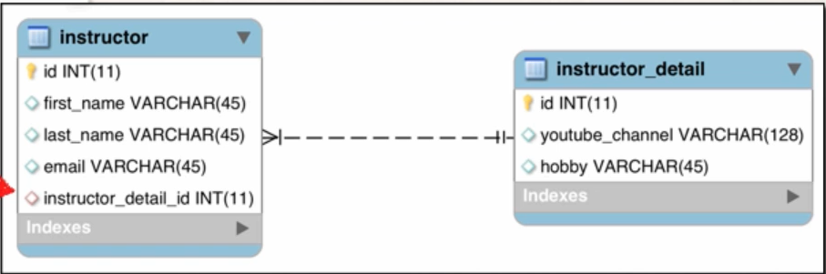
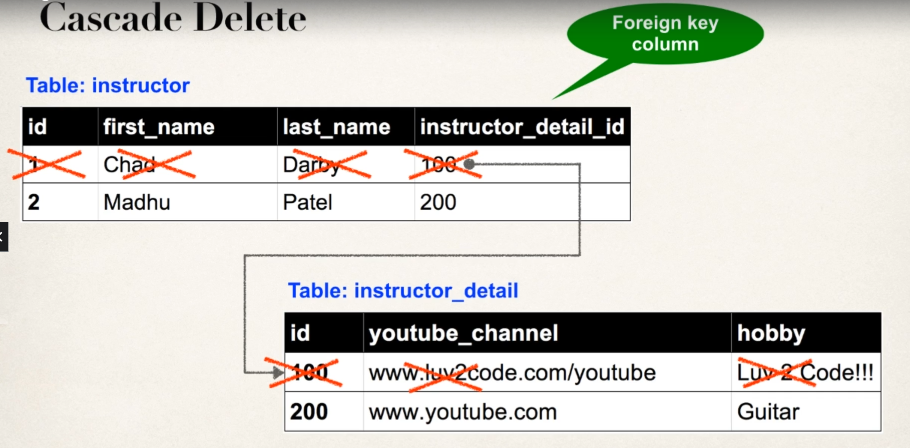
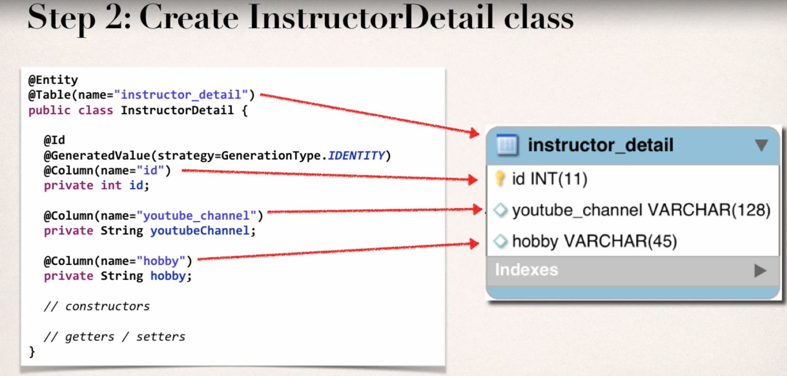
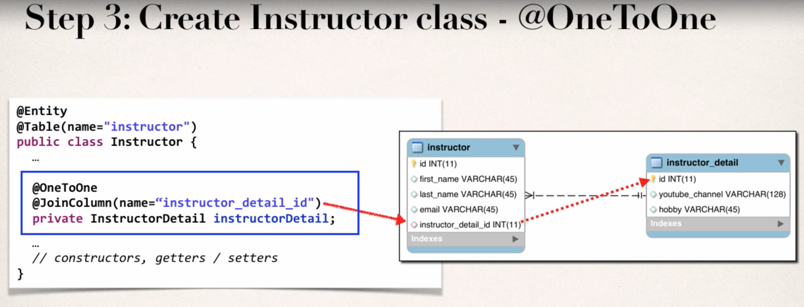
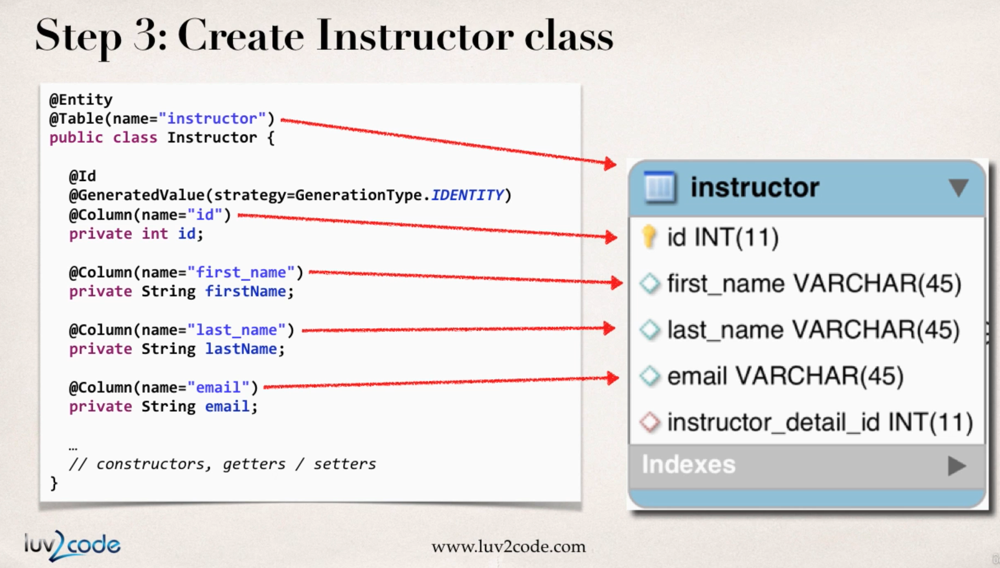
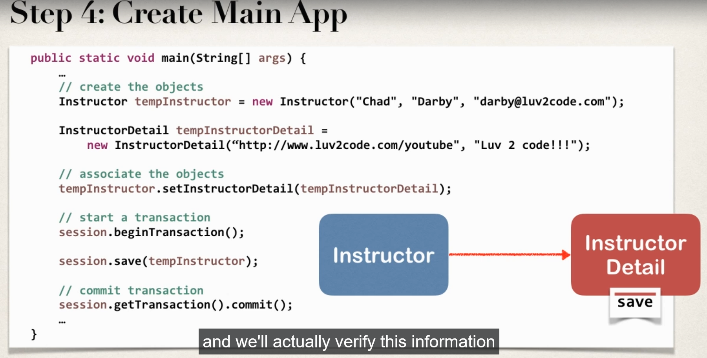

## High Level View


- An instructor can have an "instructor detail" entity. 
    - Similar to an instructor profile.
    - This example is UNI-DIRECTIONAL 

## Process 
- Prep Work - Define database tables
- Create Instructor Detail class 
- Create Instructor class
- Create Main app


## Entity Life Cycle
| Operations | Description |
|------------|-------------|
| Detach | If entity is detached, it is not assosiated with a Hibernate Session |
| Merge | If instance is detached from session, then merge will reattach to session. |
| Persist | Transitions new instance to managed state. Next flush / commit will save in db. |
| Remove | Transistions managed entity to be removed. Next flush / commit will delete from db. |
| Refresh | Reload/ synch object with data from db. Prevents stale data. |

## Representation of Entity Life Cycle


## CASCADE 


## CASCADE TYPE 
- By `DEFAULT no operations are cascaded`

| Cascade Type | Description |
|------------|-------------|
| Persist | If entity is persiste / saved, related entity will also be persisted.  |
| Remove | If entity is removed/deleted, related entity will also be deleted. |
| Refresh | If entity is refreshed, related entity will also be refreshed. |
| Detach | If entity is detached (not assosiated with the session), then related entity will also be detached |
| Merge | If entity is merged, then related entity will also be merged. |
| All | All of the above cascade types. |

### Annotation used
1. Specifying single cascade type
```Java
// This is how the Cascade Type is specified
@OneToOne(cascade = CascadeType.ALL)
```

2. Specifying multiple cascade type
```Java
// This is how the Cascade Type is specified
@OneToOne(cascade = {CascadeType.DETACH,
                     CascadeType.MERGE,
                     CascadeType.PERSIST,
                     CascadeType.REFRESH,
                     CascadeType.REMOVE})
```

## Step 1 - Database Work 
- This needs to be executed in workbench

```SQL
DROP SCHEMA IF EXISTS `hb-01-one-to-one-uni`;

CREATE SCHEMA `hb-01-one-to-one-uni`;

use `hb-01-one-to-one-uni`;

SET FOREIGN_KEY_CHECKS = 0;

DROP TABLE IF EXISTS `instructor_detail`;

CREATE TABLE `instructor_detail` (
  `id` int(11) NOT NULL AUTO_INCREMENT,
  `youtube_channel` varchar(128) DEFAULT NULL,
  `hobby` varchar(45) DEFAULT NULL,
  PRIMARY KEY (`id`)
) ENGINE=InnoDB AUTO_INCREMENT=1 DEFAULT CHARSET=latin1;


DROP TABLE IF EXISTS `instructor`;

CREATE TABLE `instructor` (
  `id` int(11) NOT NULL AUTO_INCREMENT,
  `first_name` varchar(45) DEFAULT NULL,
  `last_name` varchar(45) DEFAULT NULL,
  `email` varchar(45) DEFAULT NULL,
  `instructor_detail_id` int(11) DEFAULT NULL,
  PRIMARY KEY (`id`),
  KEY `FK_DETAIL_idx` (`instructor_detail_id`),
  CONSTRAINT `FK_DETAIL` FOREIGN KEY (`instructor_detail_id`) REFERENCES `instructor_detail` (`id`) ON DELETE NO ACTION ON UPDATE NO ACTION
) ENGINE=InnoDB AUTO_INCREMENT=1 DEFAULT CHARSET=latin1;

SET FOREIGN_KEY_CHECKS = 1;

```

## Step 2: Create InstructorDetail Class 

`src/hibernate.cfg.xml`
```Java
<!DOCTYPE hibernate-configuration PUBLIC
        "-//Hibernate/Hibernate Configuration DTD 3.0//EN"
        "http://www.hibernate.org/dtd/hibernate-configuration-3.0.dtd">

<hibernate-configuration>

    <session-factory>

        <!-- JDBC Database connection settings -->
        <property name="connection.driver_class">com.mysql.cj.jdbc.Driver</property>
        <property name="connection.url">jdbc:mysql://localhost:3306/hb-01-one-to-one-uni?useSSL=false&amp;serverTimezone=UTC</property>
        <property name="connection.username">hbstudent</property>
        <property name="connection.password">hbstudent</property>

        <!-- JDBC connection pool settings ... using built-in test pool -->
        <property name="connection.pool_size">1</property>

        <!-- Select our SQL dialect -->
        <property name="dialect">org.hibernate.dialect.MySQLDialect</property>

        <!-- Echo the SQL to stdout -->
        <property name="show_sql">true</property>

		<!-- Set the current session context -->
		<property name="current_session_context_class">thread</property>
 
    </session-factory>

</hibernate-configuration>
```

`src/com.luv2code.jdbc/TestJdbc.java`
```Java
package com.luv2code.jdbc;

import java.sql.Connection;
import java.sql.DriverManager;

public class TestJdbc {
	public static void main(String args[]) {
		String jdbcUrl = "jdbc:mysql://localhost:3306/hb-01-one-to-one-uni?useSSL=false";
		String user = "hbstudent";
		String pass = "hbstudent";
		try {
			
			System.out.println("Connecting to the database: "+jdbcUrl);
			Connection myCon = 
						DriverManager.getConnection(jdbcUrl,user,pass);
			System.out.println("Connection successful!!!");
		}
		catch(Exception e) {
			e.printStackTrace();
		}
	}
}
```

`/hb-01-one-to-one-uni/src/com/luv2code/hibernate/demo/entity/InstructorDetail.java`
```Java
package com.luv2code.hibernate.demo.entity;

import javax.persistence.Column;
import javax.persistence.Entity;
import javax.persistence.GeneratedValue;
import javax.persistence.GenerationType;
import javax.persistence.Id;
import javax.persistence.Table;


@Entity
@Table(name = "instructor_detail")
public class InstructorDetail {
	// annotate the class as an entity and map to db table
	// define the fields 
	// annotate the fields with db coloumn names 
	@Id
	@GeneratedValue(strategy=GenerationType.IDENTITY)
	@Column(name = "id")
	private int id;
	
	@Column(name="youtube_channel")
	private String youtubeChannel; 
	
	@Column(name="hobby")
	private String hobby;

	// create constructors 
	public InstructorDetail() {
		
	}

	public InstructorDetail(String youtubeChannel, String hobby) {
		this.youtubeChannel = youtubeChannel;
		this.hobby = hobby;
	}

	// generate gettes/setter method
	public String getYoutubeChannel() {
		return youtubeChannel;
	}

	public void setYoutubeChannel(String youtubeChannel) {
		this.youtubeChannel = youtubeChannel;
	}

	public String getHobby() {
		return hobby;
	}

	public void setHobby(String hobby) {
		this.hobby = hobby;
	}

	public int getId() {
		return id;
	}

	public void setId(int id) {
		this.id = id;
	}

	// generate toString() method
	@Override
	public String toString() {
		return "InstructorDetail [id=" + id + ", youtubeChannel=" + youtubeChannel + ", hobby=" + hobby + "]";
	}

}
```

## Step 3: Create Instructor class


`/hb-01-one-to-one-uni/src/com/luv2code/hibernate/demo/entity/Instructor.java`
```Java
package com.luv2code.hibernate.demo.entity;

import javax.persistence.CascadeType;
import javax.persistence.Column;
import javax.persistence.Entity;
import javax.persistence.GeneratedValue;
import javax.persistence.GenerationType;
import javax.persistence.Id;
import javax.persistence.JoinColumn;
import javax.persistence.OneToOne;
import javax.persistence.Table;

@Entity
@Table(name = "instructor")
public class Instructor {
		// annotate the class as an entity and map to db table
		// define the fields 
		// annotate the fields with db coloumn names 
		// create constructors 
		// generate gettes/setter method
		// generate toString() method
	
	@Id
	@GeneratedValue(strategy=GenerationType.IDENTITY)
	@Column(name="id")
	private int id; 
	

	@Column(name="first_name")
	private String firstName; 
	
	@Column(name="last_name")
	private String lastName; 
	
	@Column(name="email")
	private String email; 
	
	@OneToOne(cascade=CascadeType.ALL)
	@JoinColumn(name="instructor_detail_id")
	private InstructorDetail instructorDetailId; 
	
	
	public Instructor() {
		
	}
	
	public Instructor(String firstName, String lastName, String email) {
		this.firstName = firstName;
		this.lastName = lastName;
		this.email = email;
	}

	
	public int getId() {
		return id;
	}

	public void setId(int id) {
		this.id = id;
	}

	public String getFirstName() {
		return firstName;
	}

	public void setFirstName(String firstName) {
		this.firstName = firstName;
	}

	public String getLastName() {
		return lastName;
	}

	public void setLastName(String lastName) {
		this.lastName = lastName;
	}

	public String getEmail() {
		return email;
	}

	public void setEmail(String email) {
		this.email = email;
	}

	
	public InstructorDetail getInstructorDetailId() {
		return instructorDetailId;
	}


	public void setInstructorDetailId(InstructorDetail instructorDetailId) {
		this.instructorDetailId = instructorDetailId;
	}


	@Override
	public String toString() {
		return "Instructor [id=" + id + ", firstName=" + firstName + ", lastName=" + lastName + ", email=" + email
				+ ", instructorDetailId=" + instructorDetailId + "]";
	}
}
```
## Step 4: Create Main Class

`/hb-01-one-to-one-uni/src/com/luv2code/hibernate/demo/CreateDemo.java`
```Java
package com.luv2code.hibernate.demo;


import org.hibernate.Session;
import org.hibernate.SessionFactory;
import org.hibernate.cfg.Configuration;

import com.luv2code.hibernate.demo.entity.Instructor;
import com.luv2code.hibernate.demo.entity.InstructorDetail;


public class CreateDemo {

	public static void main(String[] args) {
		// TODO Create session method 
		SessionFactory factory = new Configuration()
								.configure("hibernate.cfg.xml")
								.addAnnotatedClass(Instructor.class)
								.addAnnotatedClass(InstructorDetail.class)
								.buildSessionFactory(); 
		
		// TODO Create session 
		Session session = factory.getCurrentSession();
		
		try {
			
			// create a object
			/*
			Instructor tempInstructor = new Instructor("Chad","Darby","darby@luv2code.com");
			
			InstructorDetail tempInstructorDetail = 
					new InstructorDetail("http://www.luv2code.com/youtube",
							"Luv 2 code!!!");
			
			
			*/
			Instructor tempInstructor = new Instructor("Madhu","Patel","madhu@luv2code.com");
			
			InstructorDetail tempInstructorDetail = 
					new InstructorDetail("http://www.youtube.com",
							"Guitar");
			
			// associate a object 
			tempInstructor.setInstructorDetailId(tempInstructorDetail);
			
			
			// start a transaction 
			session.beginTransaction(); 
			
			// save the instructor 
			// Note: This will also save the InstructorDetail object 
			// because of the CascadeType.ALL
			System.out.println("Saving Instructor: "+tempInstructor);
			session.save(tempInstructor);
			
			
			// commit transaction
			session.getTransaction().commit();
			System.out.println("Done");
			
		}
		finally {
			factory.close();
		}

	}


}
```

## Bonus : Deleting the Object 

`/hb-01-one-to-one-uni/src/com/luv2code/hibernate/demo/DeleteDemo.java`
```Java
package com.luv2code.hibernate.demo;

import org.hibernate.Session;
import org.hibernate.SessionFactory;
import org.hibernate.cfg.Configuration;
import com.luv2code.hibernate.demo.entity.Instructor;
import com.luv2code.hibernate.demo.entity.InstructorDetail;

public class DeleteDemo {
	public static void main(String[] args) {
		// TODO Create session method 
		SessionFactory factory = new Configuration()
								.configure("hibernate.cfg.xml")
								.addAnnotatedClass(Instructor.class)
								.addAnnotatedClass(InstructorDetail.class)
								.buildSessionFactory(); 
		
		// TODO Create session 
		Session session = factory.getCurrentSession();
		
		try {
			// start a transaction 
			session.beginTransaction(); 
			
			// get the instructor by primary key / id
			// Note: If id not found returns NULL
			int theId = 1; 
			Instructor tempInstructor = 
					session.get(Instructor.class, theId);
			System.out.println("Found Instructor: " + tempInstructor);
			
			// delete the instructor
			if(tempInstructor != null) {
				System.out.println("Deleting: "+tempInstructor);
				
				// Note : This will also delete assosiated "details" object 
				// because of CascadeType.ALL
				session.delete(tempInstructor);
			}
			
			// commit transaction
			session.getTransaction().commit();
			System.out.println("Done");
			
		}
		finally {
			factory.close();
		}

	}
}

```