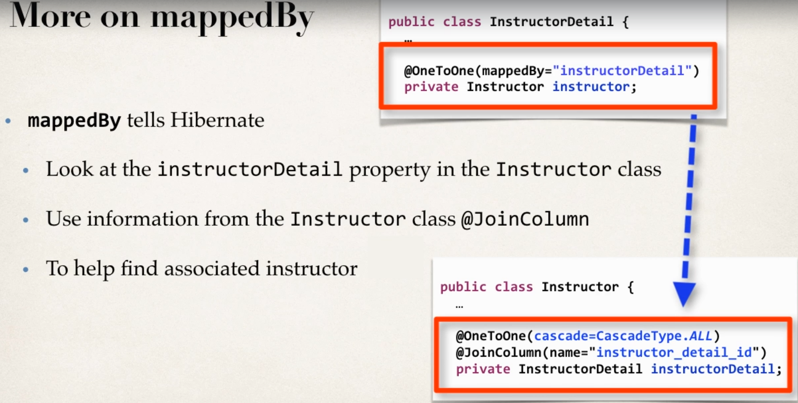

## What bidirectional Means: 
- If we load an `InstructorDetail`
    - Then we would like to get an `Instructor`
    - Bidirectional used in such use cases. 

## Requirement 
- Creating a new project 

`/hb-01-one-to-one-bi/src/hibernate.cfg.xml`
```xml
<!DOCTYPE hibernate-configuration PUBLIC
        "-//Hibernate/Hibernate Configuration DTD 3.0//EN"
        "http://www.hibernate.org/dtd/hibernate-configuration-3.0.dtd">

<hibernate-configuration>

    <session-factory>

        <!-- JDBC Database connection settings -->
        <property name="connection.driver_class">com.mysql.cj.jdbc.Driver</property>
        <property name="connection.url">jdbc:mysql://localhost:3306/hb-01-one-to-one-uni?useSSL=false&amp;serverTimezone=UTC</property>
        <property name="connection.username">hbstudent</property>
        <property name="connection.password">hbstudent</property>

        <!-- JDBC connection pool settings ... using built-in test pool -->
        <property name="connection.pool_size">1</property>

        <!-- Select our SQL dialect -->
        <property name="dialect">org.hibernate.dialect.MySQLDialect</property>

        <!-- Echo the SQL to stdout -->
        <property name="show_sql">true</property>

		<!-- Set the current session context -->
		<property name="current_session_context_class">thread</property>
 
    </session-factory>

</hibernate-configuration>
```
- Few changes in the `InstructorDetail` class. 
    1. Add new field to reference `Instructor`
    2. Add getters and setters. 
    3. Add @OneToOne annotation. 


`/hb-01-one-to-one-bi/src/com/luv2code/hibernate/demo/entity/InstructorDetail.java`
```Java
package com.luv2code.hibernate.demo.entity;

import javax.persistence.CascadeType;
import javax.persistence.Column;
import javax.persistence.Entity;
import javax.persistence.GeneratedValue;
import javax.persistence.GenerationType;
import javax.persistence.Id;
import javax.persistence.OneToOne;
import javax.persistence.Table;


@Entity
@Table(name = "instructor_detail")
public class InstructorDetail {
	// annotate the class as an entity and map to db table
	// define the fields 
	// annotate the fields with db coloumn names 
	@Id
	@GeneratedValue(strategy=GenerationType.IDENTITY)
	@Column(name = "id")
	private int id;
	
	@Column(name="youtube_channel")
	private String youtubeChannel; 
	
	@Column(name="hobby")
	private String hobby;
	
	// add new field for instructor 
	// add getters and setters methods
	//
	
	@OneToOne(mappedBy="instructorDetailId",cascade=CascadeType.ALL)
	private Instructor instructor; 
	
	// create constructors 
	public InstructorDetail() {
		
	}

	public InstructorDetail(String youtubeChannel, String hobby) {
		this.youtubeChannel = youtubeChannel;
		this.hobby = hobby;
	}

	// generate gettes/setter method
	public String getYoutubeChannel() {
		return youtubeChannel;
	}

	public void setYoutubeChannel(String youtubeChannel) {
		this.youtubeChannel = youtubeChannel;
	}

	public String getHobby() {
		return hobby;
	}

	public void setHobby(String hobby) {
		this.hobby = hobby;
	}

	public int getId() {
		return id;
	}

	public void setId(int id) {
		this.id = id;
	}
	
	
	public Instructor getInstructor() {
		return instructor;
	}

	public void setInstructor(Instructor instructor) {
		this.instructor = instructor;
	}

	// generate toString() method
	@Override
	public String toString() {
		return "InstructorDetail [id=" + id + ", youtubeChannel=" + youtubeChannel + ", hobby=" + hobby + "]";
	}

}

```
- Create Main app

`/hb-01-one-to-one-bi/src/com/luv2code/hibernate/demo/GetInstructorDetailsDemo.java`
```Java
package com.luv2code.hibernate.demo;


import org.hibernate.Session;
import org.hibernate.SessionFactory;
import org.hibernate.cfg.Configuration;

import com.luv2code.hibernate.demo.entity.Instructor;
import com.luv2code.hibernate.demo.entity.InstructorDetail;


public class GetInstructorDetailsDemo {

	public static void main(String[] args) {
		// TODO Create session method 
		SessionFactory factory = new Configuration()
								.configure("hibernate.cfg.xml")
								.addAnnotatedClass(Instructor.class)
								.addAnnotatedClass(InstructorDetail.class)
								.buildSessionFactory(); 
		
		// TODO Create session 
		Session session = factory.getCurrentSession();
		
		try {
			
					
			// start a transaction 
			session.beginTransaction(); 
			
			// get the instructor detail 
			int theId = 2;
			InstructorDetail tempInstructorDetail = session.get(InstructorDetail.class, theId);
			
			
			// print the instructor detail 
			System.out.println("Instructor Details: " +tempInstructorDetail );
			
			// print the instructor
			System.out.println("Instructor: "+tempInstructorDetail.getInstructor());
			
			
			// commit transaction
			session.getTransaction().commit();
			System.out.println("Done");
			
		}
		finally {
			factory.close();
		}

	}
}
```
- Note: We have added `cascade` parameter to providing cascading operations from InstructorDetail to Instructor. 


## Refactoring 

`/hb-01-one-to-one-bi/src/com/luv2code/hibernate/demo/GetInstructorDetailsDemo.java`
```Java
package com.luv2code.hibernate.demo;


import org.hibernate.Session;
import org.hibernate.SessionFactory;
import org.hibernate.cfg.Configuration;

import com.luv2code.hibernate.demo.entity.Instructor;
import com.luv2code.hibernate.demo.entity.InstructorDetail;


public class GetInstructorDetailsDemo {

	public static void main(String[] args) {
		// TODO Create session method 
		SessionFactory factory = new Configuration()
								.configure("hibernate.cfg.xml")
								.addAnnotatedClass(Instructor.class)
								.addAnnotatedClass(InstructorDetail.class)
								.buildSessionFactory(); 
		
		// TODO Create session 
		Session session = factory.getCurrentSession();
		
		try {
			
					
			// start a transaction 
			session.beginTransaction(); 
			
			// get the instructor detail 
			int theId = 2999;
			InstructorDetail tempInstructorDetail = session.get(InstructorDetail.class, theId);
			
			
			// print the instructor detail 
			System.out.println("Instructor Details: " +tempInstructorDetail );
			
			// print the instructor
			System.out.println("Instructor: "+tempInstructorDetail.getInstructor());
			
			
			// commit transaction
			session.getTransaction().commit();
			System.out.println("Done");
			
		}
		catch(Exception e) {
			e.printStackTrace();
		}
		finally {
			
			// Resolving the leaking issue
			session.close();
			factory.close();
		}

	}


}

```

## Deleting

`/hb-01-one-to-one-bi/src/com/luv2code/hibernate/demo/DeleteInstructorDetailsDemo.java`
```Java
package com.luv2code.hibernate.demo;


import org.hibernate.Session;
import org.hibernate.SessionFactory;
import org.hibernate.cfg.Configuration;

import com.luv2code.hibernate.demo.entity.Instructor;
import com.luv2code.hibernate.demo.entity.InstructorDetail;


public class DeleteInstructorDetailsDemo {

	public static void main(String[] args) {
		// TODO Create session method 
		SessionFactory factory = new Configuration()
								.configure("hibernate.cfg.xml")
								.addAnnotatedClass(Instructor.class)
								.addAnnotatedClass(InstructorDetail.class)
								.buildSessionFactory(); 
		
		// TODO Create session 
		Session session = factory.getCurrentSession();
		
		try {
			
					
			// start a transaction 
			session.beginTransaction(); 
			
			// get the instructor detail 
			int theId = 4;
			InstructorDetail tempInstructorDetail = session.get(InstructorDetail.class, theId);
			
			
			// print the instructor detail 
			System.out.println("Instructor Details: " +tempInstructorDetail );
			
			// print the instructor
			System.out.println("Instructor: "+tempInstructorDetail.getInstructor());

			// now lets delete the instructor 
			System.out.println("Deleting tempInstructorDetail: " + tempInstructorDetail);
			session.delete(tempInstructorDetail);
			
			// commit transaction
			session.getTransaction().commit();
			System.out.println("Done");
			
		}
		catch(Exception e) {
			e.printStackTrace();
		}
		finally {
			
			// Resolving the leaking issue
			session.close();
			factory.close();
		}

	}


}

```


## Use case: Deleting only InstructorDetail 

`/hb-01-one-to-one-bi/src/com/luv2code/hibernate/demo/DeleteInstructorDetailsDemo.java`
```Java
package com.luv2code.hibernate.demo;


import org.hibernate.Session;
import org.hibernate.SessionFactory;
import org.hibernate.cfg.Configuration;

import com.luv2code.hibernate.demo.entity.Instructor;
import com.luv2code.hibernate.demo.entity.InstructorDetail;


public class DeleteInstructorDetailsDemo {

	public static void main(String[] args) {
		// TODO Create session method 
		SessionFactory factory = new Configuration()
								.configure("hibernate.cfg.xml")
								.addAnnotatedClass(Instructor.class)
								.addAnnotatedClass(InstructorDetail.class)
								.buildSessionFactory(); 
		
		// TODO Create session 
		Session session = factory.getCurrentSession();
		
		try {
			
					
			// start a transaction 
			session.beginTransaction(); 
			
			// get the instructor detail 
			int theId = 5;
			InstructorDetail tempInstructorDetail = session.get(InstructorDetail.class, theId);
			
			
			// print the instructor detail 
			System.out.println("Instructor Details: " +tempInstructorDetail );
			
			// print the instructor
			System.out.println("Instructor: "+tempInstructorDetail.getInstructor());
			
			// remove the assosiated object reference 
			// break bi directional link 
			tempInstructorDetail.getInstructor().setInstructorDetailId(null);
			
			
			// now lets delete the instructor 
			System.out.println("Deleting tempInstructorDetail: " + tempInstructorDetail);
			session.delete(tempInstructorDetail);
			
			// commit transaction
			session.getTransaction().commit();
			System.out.println("Done");
			
		}
		catch(Exception e) {
			e.printStackTrace();
		}
		finally {
			
			// Resolving the leaking issue
			session.close();
			factory.close();
		}

	}


}

```

## MappedBy
