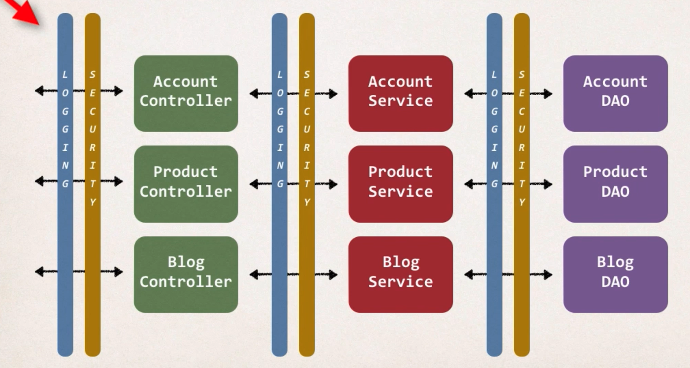

## New Req - Logging
- Need to add logging to our DAO methods . 
- Add some logging statements before the start of the method. 

## New Req - Security
- Need to add security code to our DAO. 
- Make sure user is authorized before running DAO method. 


### Now adding it to all four layers....(Very HECTIC..)

## Problems
- Code Tangling 
    - For a given method: addAccount(...)
    - We have logging and security code tangled in
- Code Scattering 
    - If we need to change logging or security code. 
    - We have to update ALL classes. 

## Other Possible Solutions 
- Inheritance 
    - Every class would need to inherit from a base class. 
    - Can all classes extends from your base class? ... plus no multiple inheritance. 
- Delgation? 
    - Classes would delegate logging, security calls. 
    - Still would need to update classes if we wanted to 
        - add/remove logging or security
        - add new features like auditing, API management, instrumentation. 


## Aspect Oriented Programming
- Programming technique based on concept of an Aspect. 
- Aspect encapsulates cross-cutting logic
- Buzz word "Cross-Cutting Concerns"
- "Concern" means logic/functionality. 

## Cross Concern Concerns 


## Aspects 
- Aspect can be reused at multiple locatations 
- Same aspect/class...applied based on configuration. 

## Apply the proxy 
- Ex: 
```
Main  <-----> AOP proxy <---- Logging Aspect --------> Target Object
App                           Security Aspect
```
`MainApp.java`
```Java
// call target object
targetObj.doSomeStuff(); 
```

`TargetObject`
```Java
public void doSomeStuff(){
    ...
}
```
- Main do not have any idea if there exists an AOP proxy.(So the name PROXY)
- Analogous to phone call. While calling we just want to talk. We have Logging , Security Aspect which are looking at our call. 
- So 
```  
            Happens Behind the scenes. (Thanks to AOP)      
             +------------------------------------+
Main  <----->| AOP proxy <---- Logging Aspect ----|---> Target Object
App          |                 Security Aspect    |
             +------------------------------------+
```

## Benefits of AOP 
- Code for Aspect is defined in a single class. 
    - Much better tha being scattered everywhere. 
    - Promotes code reuse and easier to change. 

- Business code in your application is cleaner
    - Only applies to business functionality: addAccount
    - Reduces code complexity. 

- Configurable
    - Based on configuration, apply Aspects selectively to different parts of app. 
    - No need to make changes to main application code...very important. 

## AOP Use Cases 
- Most Common
    - logging, security, transaction
- Audit Logging 
    - who, what, when, where
- Exception Handling
    - log exception and notify DevOps team via SMS/email. 
- API Management
    - how many times has a method been called user. 
    - analytics: what are peak times? what is average load? who is top user? 

## Advantages and Disadvantages
- ADV
    - Reusable modules
    - Resolve code tangling
    - Resolve code scatter
    - Applied selectively based on config
- DIADV
    - Too many aspects and app flow is hard to follow. 
        - Basically in the company there are so many devs, working, each have different aspects. 
    - Minor performance cost for aspect execution (run time weaving)[ns or ms]
        - We need to use in modulation. 