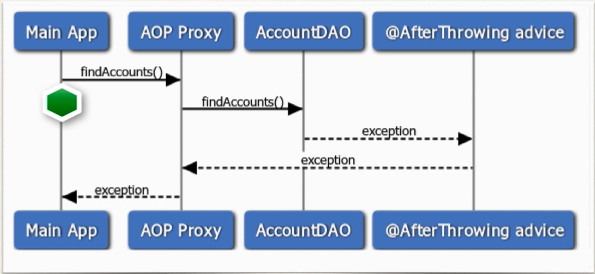

## Intro
- Runs after the method ( if exception is thrown)

## SDD


## USE CASE
- Log the exception
- Perform auditing on the exception
- Notify DevOps team via email or SMS . (Dont spam)
- Encapsulate the functionality in AOP aspect for easy reuse. 


## Access the exception 
```Java
@AfterThrowing(
    pointcut="execution(* com.luv2code.aopdemo.dao.AccountDAO.findAccounts(..))",
    throwing="theExc")
public void afterThrowingFindAccountAdvice(JoinPoint theJoinPoint, Throwable theExc){

        /// log the exception
        System.out.println("\n=====>>> The exception is: "+theExc);
    }
```

## Exception Propagation
- At this point, we are only intercepting the exception(reading it )
- However, the exception is still propagated to calling program . 
- If you want to stop the execution propagation then use the @Around advice. 

## Implementation
- Tree 
```
src
└── com
    └── luv2code
        └── aopdemo
            ├── Account.java
            ├── AfterReturningDemoApp.java
            ├── AfterThrowingDemoApp.java
            ├── DemoConfig.java
            ├── MainDemoApp.java
            ├── aspect
            │   ├── LuvAopExpressions.java
            │   ├── MyApiAnalyticsAspect.java
            │   ├── MyCloudLogAsyncAspect.java
            │   └── MyDemoLoggingAspect.java
            └── dao
                ├── AccountDAO.java
                └── MembershipDAO.java
```
**AfterThrowingDemoApp.java**
```Java
	package com.luv2code.aopdemo;

import java.util.List;

import org.springframework.context.annotation.AnnotationConfigApplicationContext;

import com.luv2code.aopdemo.dao.AccountDAO;
import com.luv2code.aopdemo.dao.MembershipDAO;

public class AfterThrowingDemoApp {

	public static void main(String[] args) {

		// read spring config java class
		AnnotationConfigApplicationContext context =
				new AnnotationConfigApplicationContext(DemoConfig.class);
		
		// get the bean from spring container
		AccountDAO theAccountDAO = context.getBean("accountDAO", AccountDAO.class);
		
		/// call method to find the accounts 
		List<Account> theAccounts = null;
		try {
			
			/// add a boolean flag to simulate exceptions
			boolean tripWire = true; 
			theAccounts = theAccountDAO.findAccounts(tripWire);
		}
		catch(Exception exc) {
			System.out.println("\n\nMain Program.....caught exception: " + exc);
		}
		
		// display the accounts 
		System.out.println("\n\nMain Program: AfterThrowingDemoApp");
		System.out.println("---");
		System.out.println(theAccounts);
		System.out.println("---\n");
		
		// close the context
		context.close();
	}

}
```

**AccountDAO.java**
```Java
package com.luv2code.aopdemo.dao;

import java.util.ArrayList;
import java.util.List;

import org.springframework.stereotype.Component;

import com.luv2code.aopdemo.Account;

@Component
public class AccountDAO {
	
	private String name; 
	private String serviceCode; 
	
	// add a new method : findAccounts()
	public List<Account> findAccounts(boolean tripWire){
		
		/// for academic purpose...simulate a exception
		if(tripWire) {
			throw new RuntimeException("No soup for you!!!");
		}
		List<Account> myAccounts = new ArrayList<>();
		
		// create sample accounts
		Account temp1 = new Account("John","Silver");
		Account temp2 = new Account("Madhu","Platinum");
		Account temp3 = new Account("Luca","Gold");
		
		
		// add them to our account list 
		myAccounts.add(temp1);
		myAccounts.add(temp2);
		myAccounts.add(temp3);
		
		return myAccounts;
	}
	public String getName() {
		System.out.println(getClass() + ": in getName()");
		return name;
	}

	public void setName(String name) {
		System.out.println(getClass() + ": in setName()");
		this.name = name;
	}

	public String getServiceCode() {
		System.out.println(getClass() + ": in getServiceCode()");
		return serviceCode;
	}

	public void setServiceCode(String serviceCode) {
		System.out.println(getClass() + ": in setServiceCode()");
		this.serviceCode = serviceCode;
	}
	
	public void addAccount(Account theAccount, boolean vipFlag) {
			System.out.println(getClass() + ": DOING MY DB WORK: ADDING AN ACCOUNT");
	}
	
	public boolean doWork() {
		System.out.println(getClass() + ": doWork()");
		return false; 
	}
}

```
**MyDemoLoggingAspect.java**
```Java
package com.luv2code.aopdemo.aspect;

import java.util.List;

import org.aspectj.lang.JoinPoint;
import org.aspectj.lang.annotation.AfterReturning;
import org.aspectj.lang.annotation.AfterThrowing;
import org.aspectj.lang.annotation.Aspect;
import org.aspectj.lang.annotation.Before;
import org.aspectj.lang.annotation.Pointcut;
import org.aspectj.lang.reflect.MethodSignature;
import org.springframework.core.annotation.Order;
import org.springframework.stereotype.Component;

import com.luv2code.aopdemo.Account;

@Aspect
@Component
@Order(2)
public class MyDemoLoggingAspect {
	/// add a new advice for @AfterThrowing
	@AfterThrowing(
			pointcut="execution(* com.luv2code.aopdemo.dao.AccountDAO.findAccounts(..))",
			throwing="theExc"
			)
	public void afterReturningFindAccountAdvice(JoinPoint theJoinPoint, Throwable theExc) {
		
		/// print out the method we are advising on 
		String method = theJoinPoint.getSignature().toShortString();
		System.out.println("\n=====>>> Executing @AfterThrowing on method: "+method);
		
		/// Display the exception
		System.out.println("\n=====>>> The exeption is "+ theExc);
	}
	
	
	
	/// add a new advice for @AfterReturning 
	@AfterReturning(
			pointcut="execution(* com.luv2code.aopdemo.dao.AccountDAO.findAccounts(..))",
			returning="result"
			)
	public void afterReturningFindAccountAdvice(JoinPoint theJoinPoint, List<Account> result) {
	
		// print out the method we are advising on 
		String method = theJoinPoint.getSignature().toShortString();
		System.out.println("\n=====>>> Executing @AfterReturning on method: "+method);
		
		// print out the results of the method call 
		System.out.println("\n=====>>> Result is : "+result);
		
		/// lets post process the data ... lets modify it 
		
		/// convert the account names to upper case 
		convertAccountNamesToUpperCase(result);
		
		/// print out the results
		System.out.println("\n=====>>> Result is : "+result);
	}
	
	
	private void convertAccountNamesToUpperCase(List<Account> result) {
		
		for(Account theAccount: result) {
			theAccount.setName(theAccount.getName().toUpperCase());
		}
		
	}


	// They will only be applied which are not getter or setter
	@Before("com.luv2code.aopdemo.aspect.LuvAopExpressions.forDaoPackageNoGetterSetter()")
	public void beforeAddAccountAdvice(JoinPoint theJoinPoint) {
			System.out.println("\n====>>> Executing @Before advice on method");
			
			// display the signature 
			MethodSignature methodSig = (MethodSignature) theJoinPoint.getSignature();
			
			System.out.println("Method: "+methodSig);
			
			// display the method arguments 
			
			// get the args 
			 Object[] args = theJoinPoint.getArgs();
			 
			 // loop thru args 
			   for(Object tempArg : args){
			        System.out.println(tempArg);
			        
			        if(tempArg instanceof Account) {
			        	// downcast and print all account related stuff
			        	Account theAccount = (Account)tempArg; 
			        	System.out.println("Account Name: "+theAccount.getName());
			        	System.out.println("Account Level: "+theAccount.getLevel());
			        	
			        }
			   }
			
	}
}
```
**Output**
```

====>>> Logging to Cloud in async fashion

====>>> Executing @Before advice on method
Method: List com.luv2code.aopdemo.dao.AccountDAO.findAccounts(boolean)
true

====>>> Performing API analytics

=====>>> Executing @AfterThrowing on method: AccountDAO.findAccounts(..)

=====>>> The exeption is java.lang.RuntimeException: No soup for you!!!


Main Program.....caught exception: java.lang.RuntimeException: No soup for you!!!


Main Program: AfterThrowingDemoApp
---
null
---


```