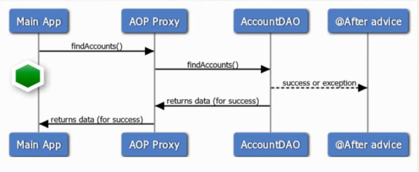
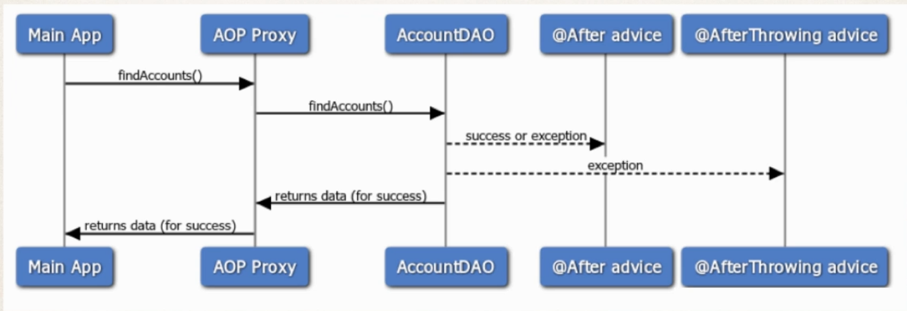

## Interaction
```
            TargetObject
@Before -------------------+
                           |
                           v
                public void doSomeStuff(){
                    ....
                }   |
                    |
@After<-------------+
(Runs after a method is completed. Regardless of the outcome / exceptions)
```
- Works just like `finally` block.

## SDDs

- @After will always run for Success or failure(finally)


- If both of @After and @AfterThrowing will match on Pointcut then @After will execute before @AfterThrowing. 

## KT
- Starting with Spring 5.2.7:

    - if advice methods defined in the same @Aspect class that need to run at the same join point

    - the @After advice method is invoked AFTER any @AfterReturning or @AfterThrowing advice methods in the same aspect class

    - So in our case, the @After and @AfterThrowing are in the same aspect class: MyDemoLoggingAspect.java, hence in latest Spring 5.2.7, the @After will run AFTER the @AfterThrowing


## Use cases 
- Log the exception and / or performing auditing
- Code to run regardless of method outcome 
- Encapsulate this functionality in AOP aspect for easy reuse. 
- Create an advice to run after the method (finally...success/failure)

## Example 
```Java
@AfterThrowing("execution(* com.luv2code.aopdemo.dao.AccountDAO.findAccounts(..))")
	public void afterFinallyFindAccountAdvice() {
		
		/// print out the method we are advising on 
		System.out.println("\n=====>>> Executing @After (finally) advice");
		
    }
```

## Tips
- The @After advice does not have access to the exception. 
    - If you need exception, then use @AfterThrowing advice. 
- The @After advice should be run in the case of success or error 
    - Your code should not depend on happy path or an exception. 
    - Logging/auditing is the easiest case here. 

## Implementation
```
src
└── com
    └── luv2code
        └── aopdemo
            ├── Account.java
            ├── AfterFinallyDemoApp.java
            ├── AfterReturningDemoApp.java
            ├── AfterThrowingDemoApp.java
            ├── DemoConfig.java
            ├── MainDemoApp.java
            ├── aspect
            │   ├── LuvAopExpressions.java
            │   ├── MyApiAnalyticsAspect.java
            │   ├── MyCloudLogAsyncAspect.java
            │   └── MyDemoLoggingAspect.java
            └── dao
                ├── AccountDAO.java
                └── MembershipDAO.java
```
**MyDemoLoggingAspect.java**
```Java
package com.luv2code.aopdemo.aspect;

import java.util.List;

import org.aspectj.lang.JoinPoint;
import org.aspectj.lang.annotation.After;
import org.aspectj.lang.annotation.AfterReturning;
import org.aspectj.lang.annotation.AfterThrowing;
import org.aspectj.lang.annotation.Aspect;
import org.aspectj.lang.annotation.Before;
import org.aspectj.lang.annotation.Pointcut;
import org.aspectj.lang.reflect.MethodSignature;
import org.springframework.core.annotation.Order;
import org.springframework.stereotype.Component;

import com.luv2code.aopdemo.Account;

@Aspect
@Component
@Order(2)
public class MyDemoLoggingAspect {
	@After("execution(* com.luv2code.aopdemo.dao.AccountDAO.findAccounts(..))")
	public void afterFinallyFindAccountAdvice(JoinPoint theJoinPoint) {
		/// print out the method we are advising on 
		String method = theJoinPoint.getSignature().toShortString();
		System.out.println("\n=====>>> Executing @After (finally) on method: "+method);
		
	}
	
	
	
	/// add a new advice for @AfterThrowing
	@AfterThrowing(
			pointcut="execution(* com.luv2code.aopdemo.dao.AccountDAO.findAccounts(..))",
			throwing="theExc"
			)
	public void afterReturningFindAccountAdvice(JoinPoint theJoinPoint, Throwable theExc) {
		
		/// print out the method we are advising on 
		String method = theJoinPoint.getSignature().toShortString();
		System.out.println("\n=====>>> Executing @AfterThrowing on method: "+method);
		
		/// Display the exception
		System.out.println("\n=====>>> The exeption is "+ theExc);
	}
	
	
	
	/// add a new advice for @AfterReturning 
	@AfterReturning(
			pointcut="execution(* com.luv2code.aopdemo.dao.AccountDAO.findAccounts(..))",
			returning="result"
			)
	public void afterReturningFindAccountAdvice(JoinPoint theJoinPoint, List<Account> result) {
	
		// print out the method we are advising on 
		String method = theJoinPoint.getSignature().toShortString();
		System.out.println("\n=====>>> Executing @AfterReturning on method: "+method);
		
		// print out the results of the method call 
		System.out.println("\n=====>>> Result is : "+result);
		
		/// lets post process the data ... lets modify it 
		
		/// convert the account names to upper case 
		convertAccountNamesToUpperCase(result);
		
		/// print out the results
		System.out.println("\n=====>>> Result is : "+result);
	}
	
	
	private void convertAccountNamesToUpperCase(List<Account> result) {
		
		for(Account theAccount: result) {
			theAccount.setName(theAccount.getName().toUpperCase());
		}
		
	}


	// They will only be applied which are not getter or setter
	@Before("com.luv2code.aopdemo.aspect.LuvAopExpressions.forDaoPackageNoGetterSetter()")
	public void beforeAddAccountAdvice(JoinPoint theJoinPoint) {
			System.out.println("\n====>>> Executing @Before advice on method");
			
			// display the signature 
			MethodSignature methodSig = (MethodSignature) theJoinPoint.getSignature();
			
			System.out.println("Method: "+methodSig);
			
			// display the method arguments 
			
			// get the args 
			 Object[] args = theJoinPoint.getArgs();
			 
			 // loop thru args 
			   for(Object tempArg : args){
			        System.out.println(tempArg);
			        
			        if(tempArg instanceof Account) {
			        	// downcast and print all account related stuff
			        	Account theAccount = (Account)tempArg; 
			        	System.out.println("Account Name: "+theAccount.getName());
			        	System.out.println("Account Level: "+theAccount.getLevel());
			        	
			        }
			   }
			
	}
}
```
**AfterFinallyDemoApp.java**
```Java
	package com.luv2code.aopdemo;

import java.util.List;

import org.springframework.context.annotation.AnnotationConfigApplicationContext;

import com.luv2code.aopdemo.dao.AccountDAO;
import com.luv2code.aopdemo.dao.MembershipDAO;

public class AfterFinallyDemoApp {

	public static void main(String[] args) {

		// read spring config java class
		AnnotationConfigApplicationContext context =
				new AnnotationConfigApplicationContext(DemoConfig.class);
		
		// get the bean from spring container
		AccountDAO theAccountDAO = context.getBean("accountDAO", AccountDAO.class);
		
		/// call method to find the accounts 
		List<Account> theAccounts = null;
		try {
			
			/// add a boolean flag to simulate exceptions
			boolean tripWire = true; 
			theAccounts = theAccountDAO.findAccounts(tripWire);
		}
		catch(Exception exc) {
			System.out.println("\n\nMain Program.....caught exception: " + exc);
		}
		
		// display the accounts 
		System.out.println("\n\nMain Program: AfterThrowingDemoApp");
		System.out.println("---");
		System.out.println(theAccounts);
		System.out.println("---\n");
		
		// close the context
		context.close();
	}

}
```
**Output**
```

====>>> Logging to Cloud in async fashion

====>>> Executing @Before advice on method
Method: List com.luv2code.aopdemo.dao.AccountDAO.findAccounts(boolean)
true

====>>> Performing API analytics

=====>>> Executing @AfterThrowing on method: AccountDAO.findAccounts(..)

=====>>> The exeption is java.lang.RuntimeException: No soup for you!!!

=====>>> Executing @After (finally) on method: AccountDAO.findAccounts(..)


Main Program.....caught exception: java.lang.RuntimeException: No soup for you!!!


Main Program: AfterThrowingDemoApp
---
null
---

```

**Trip Wire set to False**
**Output**
```
====>>> Logging to Cloud in async fashion

====>>> Executing @Before advice on method
Method: List com.luv2code.aopdemo.dao.AccountDAO.findAccounts(boolean)
false

====>>> Performing API analytics

=====>>> Executing @AfterReturning on method: AccountDAO.findAccounts(..)

=====>>> Result is : [Account [name=John, level=Silver], Account [name=Madhu, level=Platinum], Account [name=Luca, level=Gold]]

=====>>> Result is : [Account [name=JOHN, level=Silver], Account [name=MADHU, level=Platinum], Account [name=LUCA, level=Gold]]

=====>>> Executing @After (finally) on method: AccountDAO.findAccounts(..)


Main Program: AfterThrowingDemoApp
---
[Account [name=JOHN, level=Silver], Account [name=MADHU, level=Platinum], Account [name=LUCA, level=Gold]]
---
```
