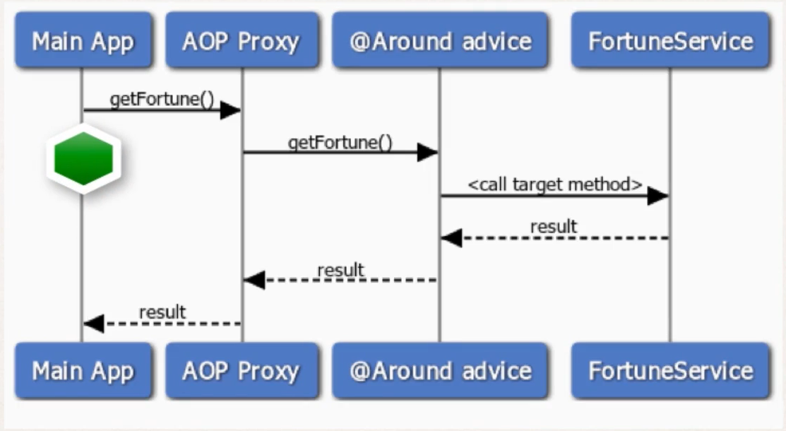

## Intro
- Run before and after method

## Interaction
```
MainApp

// call target object  <------>    AOP -------->@Around -----> TargetObject
targetObj.doSomeStuff();          PROXY<-------[Logging]<----  public void doSomeStuff(){
                                               [Aspect]            ...
                                                                }
```                                    
- @Around: Like a combination of @Before and @After. But gives you more fine grained control 

## Most Common Use Cases 
- Most common: Logging , auditing , security 
- Preprocessing and post processing data 
- Instrumentation / profiling code. 
    - How long does it take for a section of code to run? 
- Managing Exception? 
    - Swallow / handle / stop exceptions

## SDD
- We are trying to call our target method named getFortune(). 


## Proceeding JoinPoint
- When using @Around advice
- You will get a reference to a "proceeding join point" 
- This is just a handle to the target method 
- Your code can use the **proceeding join point** to execute the **target method**.

## Example 
- Create a advice for instrumentation / profiling code. 
- How long does it take for a section of code to run. 
```Java
@Around("execution(* com.luv2code.aopdemo.service.*.getFortune(..))")
public Object afterGetFortune(
        ProceedingJoinPoint theProceedingJoinPoint) throws Throwable{
            /// get begin timestamp
            long begin = System.currentTimeMillis(); 

            /// now let's execute the method
            Object result = theProceedingJoinPoint.proceed();

            /// get end timestamp
            long end = System.currentTimeMillis();

            /// compute duration and display it. 
            long duration = end - begin; 
            System.out.println("\n====>>> Duration: "+duration+" milliseconds");
        }

```

## Process
- Prep Work 
- Create TrafficFortuneService
- Update Main app to call TrafficFortuneService
- Add @Around advice. 


## Implementation Part First 
**Folder**
```
src
└── com
    └── luv2code
        └── aopdemo
            ├── Account.java
            ├── AroundDemoApp.java
            ├── DemoConfig.java
            ├── MainDemoApp.java
            ├── aspect
            │   ├── LuvAopExpressions.java
            │   ├── MyApiAnalyticsAspect.java
            │   ├── MyCloudLogAsyncAspect.java
            │   └── MyDemoLoggingAspect.java
            ├── dao
            │   ├── AccountDAO.java
            │   └── MembershipDAO.java
            └── service
                └── TrafficFortuneService.java
```
**AroundDemoApp.java**
```Java
package com.luv2code.aopdemo;


import org.springframework.context.annotation.AnnotationConfigApplicationContext;

import com.luv2code.aopdemo.service.TrafficFortuneService;

public class AroundDemoApp {

	public static void main(String[] args) {

		// read spring config java class
		AnnotationConfigApplicationContext context =
				new AnnotationConfigApplicationContext(DemoConfig.class);
		
		// get the bean from spring container
		TrafficFortuneService theFortuneService = context.getBean("trafficFortuneService", TrafficFortuneService.class);
		
		System.out.println("\nMain program: AroundDemoApp");
		
		System.out.println("Calling getFortune");
		
		String data = theFortuneService.getFortune();
		
		System.out.println("\nMy fortune is: "+data);
		
		System.out.println("Finished");
		
		// close the context
		context.close();
	}

}
```

**MyDemoLoggingAspect.java**
```Java
package com.luv2code.aopdemo.aspect;

import java.util.List;

import org.aspectj.lang.JoinPoint;
import org.aspectj.lang.ProceedingJoinPoint;
import org.aspectj.lang.annotation.After;
import org.aspectj.lang.annotation.AfterReturning;
import org.aspectj.lang.annotation.AfterThrowing;
import org.aspectj.lang.annotation.Around;
import org.aspectj.lang.annotation.Aspect;
import org.aspectj.lang.annotation.Before;
import org.aspectj.lang.annotation.Pointcut;
import org.aspectj.lang.reflect.MethodSignature;
import org.springframework.core.annotation.Order;
import org.springframework.stereotype.Component;

import com.luv2code.aopdemo.Account;

@Aspect
@Component
@Order(2)
public class MyDemoLoggingAspect {
	@Around("execution(* com.luv2code.aopdemo.service.*.getFortune(..))")
	public Object aroundGetFortune(ProceedingJoinPoint theProceedingJoinPoint) throws Throwable {
		/// print out the method we are advising on 
		String method = theProceedingJoinPoint.getSignature().toShortString();
		System.out.println("\n=====>>> Executing @Around on method: "+method);
		
		/// get begin timestamp
        long begin = System.currentTimeMillis(); 

        /// now let's execute the method
        Object result = theProceedingJoinPoint.proceed();

        /// get end timestamp
        long end = System.currentTimeMillis();

        /// compute duration and display it. 
        long duration = end - begin; 
        System.out.println("\n====>>> Duration: "+duration/1000.0 +"seconds");
        
        
        /// propagate the result to the 
        return result; 
	}
	
	@After("execution(* com.luv2code.aopdemo.dao.AccountDAO.findAccounts(..))")
	public void afterFinallyFindAccountAdvice(JoinPoint theJoinPoint) {
		/// print out the method we are advising on 
		String method = theJoinPoint.getSignature().toShortString();
		System.out.println("\n=====>>> Executing @After (finally) on method: "+method);
		
	}
	
	/// add a new advice for @AfterThrowing
	@AfterThrowing(
			pointcut="execution(* com.luv2code.aopdemo.dao.AccountDAO.findAccounts(..))",
			throwing="theExc"
			)
	public void afterReturningFindAccountAdvice(JoinPoint theJoinPoint, Throwable theExc) {
		
		/// print out the method we are advising on 
		String method = theJoinPoint.getSignature().toShortString();
		System.out.println("\n=====>>> Executing @AfterThrowing on method: "+method);
		
		/// Display the exception
		System.out.println("\n=====>>> The exeption is "+ theExc);
	}
	
	/// add a new advice for @AfterReturning 
	@AfterReturning(
			pointcut="execution(* com.luv2code.aopdemo.dao.AccountDAO.findAccounts(..))",
			returning="result"
			)
	public void afterReturningFindAccountAdvice(JoinPoint theJoinPoint, List<Account> result) {
	
		// print out the method we are advising on 
		String method = theJoinPoint.getSignature().toShortString();
		System.out.println("\n=====>>> Executing @AfterReturning on method: "+method);
		
		// print out the results of the method call 
		System.out.println("\n=====>>> Result is : "+result);
		
		/// lets post process the data ... lets modify it 
		
		/// convert the account names to upper case 
		convertAccountNamesToUpperCase(result);
		
		/// print out the results
		System.out.println("\n=====>>> Result is : "+result);
	}
	
	
	private void convertAccountNamesToUpperCase(List<Account> result) {
		
		for(Account theAccount: result) {
			theAccount.setName(theAccount.getName().toUpperCase());
		}
		
	}


	// They will only be applied which are not getter or setter
	@Before("com.luv2code.aopdemo.aspect.LuvAopExpressions.forDaoPackageNoGetterSetter()")
	public void beforeAddAccountAdvice(JoinPoint theJoinPoint) {
			System.out.println("\n====>>> Executing @Before advice on method");
			
			// display the signature 
			MethodSignature methodSig = (MethodSignature) theJoinPoint.getSignature();
			
			System.out.println("Method: "+methodSig);
			
			// display the method arguments 
			
			// get the args 
			 Object[] args = theJoinPoint.getArgs();
			 
			 // loop thru args 
			   for(Object tempArg : args){
			        System.out.println(tempArg);
			        
			        if(tempArg instanceof Account) {
			        	// downcast and print all account related stuff
			        	Account theAccount = (Account)tempArg; 
			        	System.out.println("Account Name: "+theAccount.getName());
			        	System.out.println("Account Level: "+theAccount.getLevel());
			        	
			        }
			   }
			
	}
}
```

**TrafficFortuneService.java**
```Java
package com.luv2code.aopdemo.service;

import java.util.concurrent.TimeUnit;

import org.springframework.stereotype.Component;

@Component
public class TrafficFortuneService {
	
	public String getFortune() {
		try {
		// simulate a delay 
		TimeUnit.SECONDS.sleep(5);
		}
		catch(InterruptedException exc) {
			exc.printStackTrace();
		}
		
		
		// return a fortune
		return "Expect Heavy traffic this morning";
		
	}
}
```

**Output**
```
Main program: AroundDemoApp
Calling getFortune

=====>>> Executing @Around on method: TrafficFortuneService.getFortune()

====>>> Duration: 5.03 milliseconds

My fortune is: Expect Heavy traffic this morning
Finished
```

## Resolving print order issue 
- Root Cause 
    - The data is printing to two different output streams. 
    - Spring is printing to the logger output stream. 
    - System.out.println is printing to the standard out output stream. 

- Solution
    - To have everything in order, you should send to same output stream. 
    - We'll change our code to use the logger output stream...same as Spring. 

## Implementation with Logger
```
src
└── com
    └── luv2code
        └── aopdemo
            ├── Account.java
            ├── AroundDemoApp.java
            ├── AroundWithLoggerDemoApp.java
            ├── DemoConfig.java
            ├── MainDemoApp.java
            ├── aspect
            │   ├── LuvAopExpressions.java
            │   ├── MyApiAnalyticsAspect.java
            │   ├── MyCloudLogAsyncAspect.java
            │   └── MyDemoLoggingAspect.java
            ├── dao
            │   ├── AccountDAO.java
            │   └── MembershipDAO.java
            └── service
                └── TrafficFortuneService.java
```

**AroundWithLoggerDemoApp.java**
```Java
package com.luv2code.aopdemo;


import java.util.logging.Logger;

import org.springframework.context.annotation.AnnotationConfigApplicationContext;

import com.luv2code.aopdemo.service.TrafficFortuneService;

public class AroundWithLoggerDemoApp {
	
	private static Logger myLogger = 
						Logger.getLogger(AroundWithLoggerDemoApp.class.getName());
	
	public static void main(String[] args) {

		// read spring config java class
		AnnotationConfigApplicationContext context =
				new AnnotationConfigApplicationContext(DemoConfig.class);
		
		// get the bean from spring container
		TrafficFortuneService theFortuneService = context.getBean("trafficFortuneService", TrafficFortuneService.class);
		
		myLogger.info("\nMain program: AroundDemoApp");
		
		myLogger.info("Calling getFortune");
		
		String data = theFortuneService.getFortune();
		
		myLogger.info("\nMy fortune is: "+data);
		
		myLogger.info("Finished");
		
		// close the context
		context.close();
	}

}
```

**MyDemoLoggingAspect.java**
```Java
package com.luv2code.aopdemo.aspect;

import java.util.List;
import java.util.logging.Logger;

import org.aspectj.lang.JoinPoint;
import org.aspectj.lang.ProceedingJoinPoint;
import org.aspectj.lang.annotation.After;
import org.aspectj.lang.annotation.AfterReturning;
import org.aspectj.lang.annotation.AfterThrowing;
import org.aspectj.lang.annotation.Around;
import org.aspectj.lang.annotation.Aspect;
import org.aspectj.lang.annotation.Before;
import org.aspectj.lang.annotation.Pointcut;
import org.aspectj.lang.reflect.MethodSignature;
import org.springframework.core.annotation.Order;
import org.springframework.stereotype.Component;

import com.luv2code.aopdemo.Account;

@Aspect
@Component
@Order(2)
public class MyDemoLoggingAspect {
	private Logger myLogger = Logger.getLogger(getClass().getName());
	
	
	@Around("execution(* com.luv2code.aopdemo.service.*.getFortune(..))")
	public Object aroundGetFortune(ProceedingJoinPoint theProceedingJoinPoint) throws Throwable {
		/// print out the method we are advising on 
		String method = theProceedingJoinPoint.getSignature().toShortString();
		myLogger.info("\n=====>>> Executing @Around on method: "+method);
		
		/// get begin timestamp
        long begin = System.currentTimeMillis(); 

        /// now let's execute the method
        Object result = theProceedingJoinPoint.proceed();

        /// get end timestamp
        long end = System.currentTimeMillis();

        /// compute duration and display it. 
        long duration = end - begin; 
        myLogger.info("\n====>>> Duration: "+duration/1000.0 +"seconds");
        
        
        /// propagate the result to the 
        return result; 
	}
	
	@After("execution(* com.luv2code.aopdemo.dao.AccountDAO.findAccounts(..))")
	public void afterFinallyFindAccountAdvice(JoinPoint theJoinPoint) {
		/// print out the method we are advising on 
		String method = theJoinPoint.getSignature().toShortString();
		myLogger.info("\n=====>>> Executing @After (finally) on method: "+method);
		
	}
	
	/// add a new advice for @AfterThrowing
	@AfterThrowing(
			pointcut="execution(* com.luv2code.aopdemo.dao.AccountDAO.findAccounts(..))",
			throwing="theExc"
			)
	public void afterReturningFindAccountAdvice(JoinPoint theJoinPoint, Throwable theExc) {
		
		/// print out the method we are advising on 
		String method = theJoinPoint.getSignature().toShortString();
		myLogger.info("\n=====>>> Executing @AfterThrowing on method: "+method);
		
		/// Display the exception
		myLogger.info("\n=====>>> The exeption is "+ theExc);
	}
	
	/// add a new advice for @AfterReturning 
	@AfterReturning(
			pointcut="execution(* com.luv2code.aopdemo.dao.AccountDAO.findAccounts(..))",
			returning="result"
			)
	public void afterReturningFindAccountAdvice(JoinPoint theJoinPoint, List<Account> result) {
	
		// print out the method we are advising on 
		String method = theJoinPoint.getSignature().toShortString();
		myLogger.info("\n=====>>> Executing @AfterReturning on method: "+method);
		
		// print out the results of the method call 
		myLogger.info("\n=====>>> Result is : "+result);
		
		/// lets post process the data ... lets modify it 
		
		/// convert the account names to upper case 
		convertAccountNamesToUpperCase(result);
		
		/// print out the results
		myLogger.info("\n=====>>> Result is : "+result);
	}
	
	
	private void convertAccountNamesToUpperCase(List<Account> result) {
		
		for(Account theAccount: result) {
			theAccount.setName(theAccount.getName().toUpperCase());
		}
		
	}


	// They will only be applied which are not getter or setter
	@Before("com.luv2code.aopdemo.aspect.LuvAopExpressions.forDaoPackageNoGetterSetter()")
	public void beforeAddAccountAdvice(JoinPoint theJoinPoint) {
			myLogger.info("\n====>>> Executing @Before advice on method");
			
			// display the signature 
			MethodSignature methodSig = (MethodSignature) theJoinPoint.getSignature();
			
			myLogger.info("Method: "+methodSig);
			
			// display the method arguments 
			
			// get the args 
			 Object[] args = theJoinPoint.getArgs();
			 
			 // loop thru args 
			   for(Object tempArg : args){
			        myLogger.info(tempArg.toString());
			        
			        if(tempArg instanceof Account) {
			        	// downcast and print all account related stuff
			        	Account theAccount = (Account)tempArg; 
			        	myLogger.info("Account Name: "+theAccount.getName());
			        	myLogger.info("Account Level: "+theAccount.getLevel());
			        	
			        }
			   }
			
	}
}
```

**Output**
```
Feb 06, 2022 10:59:06 AM com.luv2code.aopdemo.AroundWithLoggerDemoApp main
INFO: 
Main program: AroundDemoApp
Feb 06, 2022 10:59:06 AM com.luv2code.aopdemo.AroundWithLoggerDemoApp main
INFO: Calling getFortune
Feb 06, 2022 10:59:06 AM com.luv2code.aopdemo.aspect.MyDemoLoggingAspect aroundGetFortune
INFO: 
=====>>> Executing @Around on method: TrafficFortuneService.getFortune()
Feb 06, 2022 10:59:11 AM com.luv2code.aopdemo.aspect.MyDemoLoggingAspect aroundGetFortune
INFO: 
====>>> Duration: 5.055seconds
Feb 06, 2022 10:59:11 AM com.luv2code.aopdemo.AroundWithLoggerDemoApp main
INFO: 
My fortune is: Expect Heavy traffic this morning
Feb 06, 2022 10:59:11 AM com.luv2code.aopdemo.AroundWithLoggerDemoApp main
INFO: Finished
```
