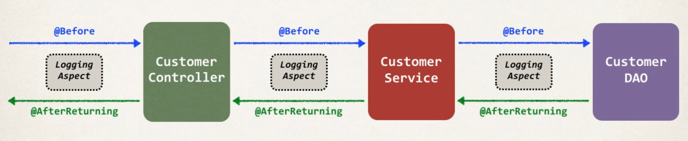

## Adding AOP support in CRM 
- Interaction Diagram

## Developement Proces
1. Add AspectJ JAR file to web project
2. Enable AspectJ auto proxy. 
3. Create Aspect
    1. Add logging support 
    2. Setup pointcut declarations
    3. Add @Before advice. 
    4. Add @AfterReturning advice. 

## If you want to use pure Java configuration the use the annotation`@EnableAspectJAutoProxy` for preprocessing @Aspect classes. 