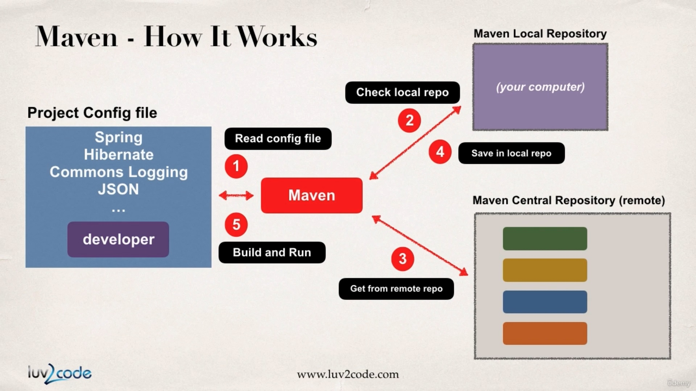
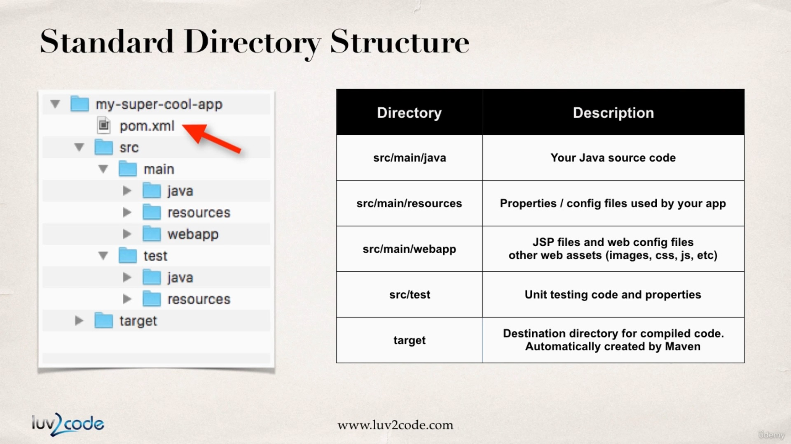
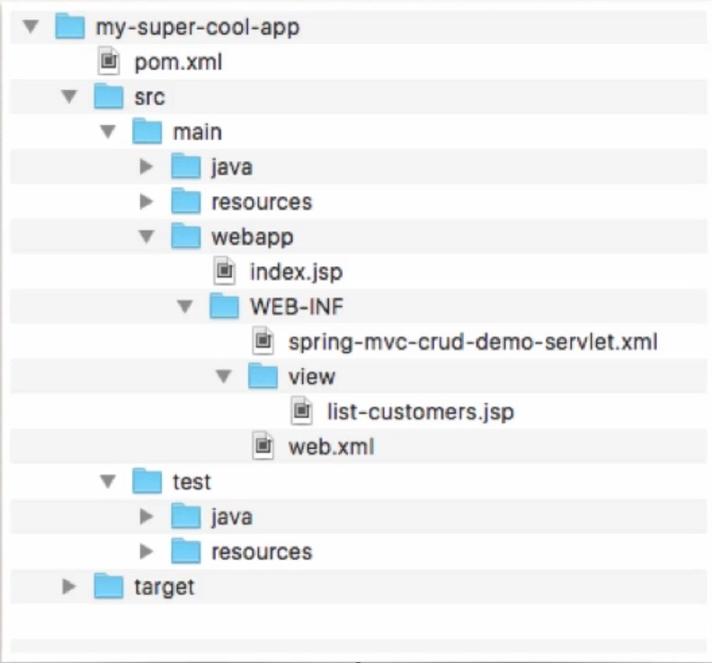
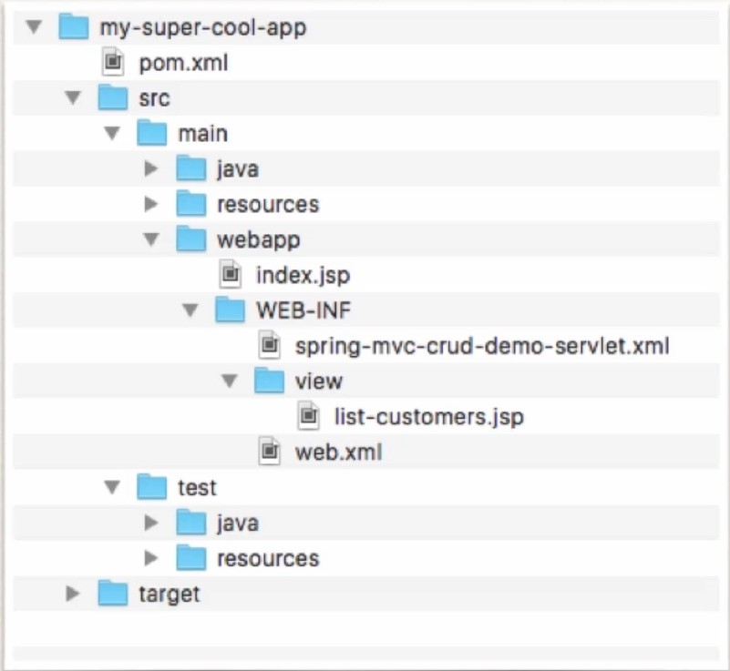

## Learning Milestones
- Create maven projecst with Eclipse 
- Add dependencies to Maven pom.xml file. 
- Build and run Maven projects. 
- Cover the most common Maven tasks that you will need on daily projects. 
- [Maven Reference Manual](www.luv2code.com/mavenreferencemanual)

## Intro
- Maven is project management tool 
- Most popular use of Maven is for build management and dependencies 

## What problem Does maven solve? 
- When building your Java project, you may need addittional JAR files. 
    - For ex. Spring, Hibernate , Commons logging, JSON etc...
- One approach is to download the JAR files from each project web site. 
- Manually add the JAR files to build path / classpath. 

## Maven Solution
- Tell maven the projects you are working with (dependencies)
    - Spring, Hibernate etc...
- Maven will go out and download the JAR files for those projects for you. 
- And maven will make those JAR files available during compile / run.
- Think of maven as your friendly helper / personal shopper. 

## How? 
- Maven has an central repository (remote) from which it downloads all the dependency. 
- 

## Handling JAR depencies 
- When MAVEN retrieves a project dependency
    - It will also download supporting dependencies 
    - For example : Spring depends on commons-logging...
- Maven will handle this for us automagically.

## Building and Running
- When you build and run your app...
- Maven will handle class / build path for you. 
- Based on config file, Maven will add JAR files accordingly. 

## Standard Directory Structure 
- Normally when you join a new project.
    - Each developement team dreams up their own directory structure.
    - Not ideal for new comers and not standardized. 
- Maven solves this problem by providing a standard directory structure.

- Normal project directoroy structure

- Normal dynamic web project directory structure

## Standard Directory Structure Benefits 
- For new developers joining a project 
- They can easily find code, properties files, unit tests , web files etc...
- Most IDEs have builtin support for MAVEN
    - Eclipse, Intellij, Netbeans etc. 
    - IDEs can easily read/import Maven project. 
- Maven project are portable
    -  Developers can share project between the IDEs. 
 
 ## Adv
- Once you learn maven, you can join a new project and be productive
- You can build and run a project with minimal local configuration

