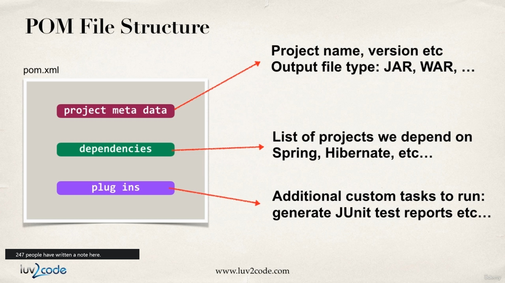
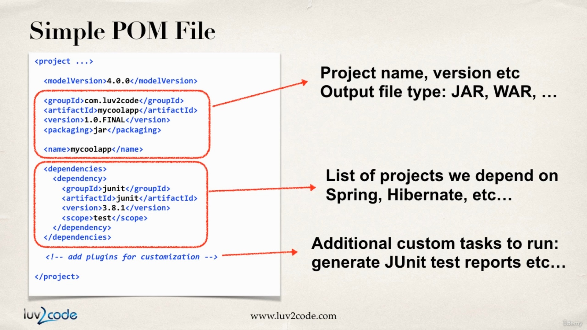
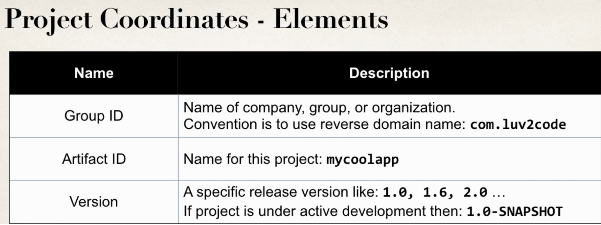

## POM 
- Project Object Model 
- Configuration file for your project. 
    - Basically your "shopping list" for Maven. 
- Located in root of your Maven project. 

## Structure 




## Project Coordinates
- Project coordinates uniquely identify a project. 
    - Similar to GPS coordinates for your house . Latitude / longitude
```xml
<groupId>com.luv2code</groupId>
<artifactId>mycoolapp</artifactId>
<version>1.0.FINAL<version>
```
- Meaning


## Examples of Project Coordinates 
- Spring 
```xml
<groupId>org.springframework</groupId>
<artifactId>spring-context</artifactId>
<version>5.0.0.RELEASE<version>
```

- Hibernate
```xml
<groupId>org.hibernate</groupId>
<artifactId>hibernate-core</artifactId>
<version>5.2.11.Final<version>
```

## Adding Dependencies 
```xml
<project ...>
...
    <dependencies>

        <dependency>
            <groupId>org.springframework</groupId>
            <artifactId>spring-context</artifactId>
            <version>5.0.0.RELEASE<version>
        </dependency>

        <dependency>
            <groupId>org.hibernate</groupId>
            <artifactId>hibernate-core</artifactId>
            <version>5.2.11.Final<version>
        </dependency>
        ...
    </dependencies>

</project>
```

## Dependency Coordinates
- To add a given dependency project, we need 
    - Group ID, Artifact Id
    - Version is optional...
        - Best practice is to include the version(repeatable builds)[DevOps]
- May see this referred to as **GAV**
    - **G**roup ID, **A**rtifact ID, **V**ersion ID

## How to find dependency coordinates 
- Option 1: Visit the project page (spring.io.hibernate.org etc)
- Option 2: Visit http://search.maven.org(easiest approach) <----always start here 
- Option 3: Visit http://www.mvnrepository.com   <------ second option 

## Maven Archetypes 
- Acrchetypes can be use create new Maven project. 
- Contain templates files for a given Maven project. 
- Think of its as collection of "starter files " for a project. 
    - Java Project, Web Project
-  Visit http://maven.apache.org/archetypes for more archetypes

## Common Archetypes
|Archetype Artifact ID|Description|
|---------------------|-----------|
|maven-archetype-quickstart|An archetype to generate a sample Maven project ( for normal applications)|
|maven-archetype-webapp|An archetype to sample maven webapp project|
|...others...|...|

- You can create new projects using Maven Archetypes (starter project)
    - From the command-line with Maven 
    - From the IDE 
        - Eclipse, IntelliJ, Netbeans etc...

## Quickstart Archetype
- `maven-archetype-quickstart` contains a sample Maven project
```
project
  |--pom.xml
  |--src/main/java/App.java
  +--src/test/java/AppTest.java

```

## Webapp Archetype
- `maven-archetype-webapp` contains a sample Maven webapp project
```
project
  |--pom.xml
  |--src/main/webapp/index.jsp
  +--src/test/webapp/WEB-INF/web.xml

```