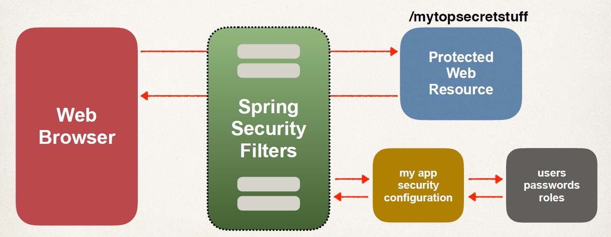
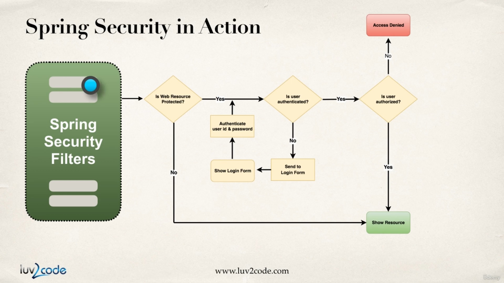

## To be learnt
- Secure spring MVC web apps. 
- Develope login pages (Default and custom). 
- Define users and roles with simple authentication. 
- Protect URLs based on role. 
- Use JSP tags to hide / show content based on role. 
- Store users, passwords and roles in DB(plain-text -> encrypted)

## To remember is : 
- Covers the most common Spring security tasks that you will need on daily projects. 
- Not an A to Z reference... for that you can see [Spring Security Reference Manual](http://www.luv2code.com/spring-security-reference-manual)

## Spring Security Model 
- Spring Security defines a framework for security
- Implemented using Servlet filters in the background
- Two methods of securing a Web app: **declarative** and **programmatic**

## Spring Security with Servlet Filters
- Servlet Filters are used to pre-process / post-process web requests
- Servlet Filters can route web requests based on security logic
- Spring provides a bulk of security functionality with servlet filters

## Architecture 

## Security in action 

## Security Concepts
- Authentication
    - Check user id and password with credentials stored in app / db
- Authorization
    - Check to see if user has an authorized role

## Declarative Security
- Define application’s security constraints in configuration
    - All Java config (@Configuration, no xml)
    - or Spring XML config
- Provides separation of concerns between application code and security

## Programmatic Security
- Spring Security provides an API for custom application coding
- Provides greater customization for specific app requirements

## Different Login Methods
- HTTP Basic Authentication
- Default login form
    - Spring Security provides a default login form
- Custom login form
    - your own look-and-feel, HTML + CSS

## Authentication and Authorization
- In-memory
- JDBC
- LDAP
- Custom / Pluggable
- others …
- We will cover password storage in DB as plain-text AND encrypted