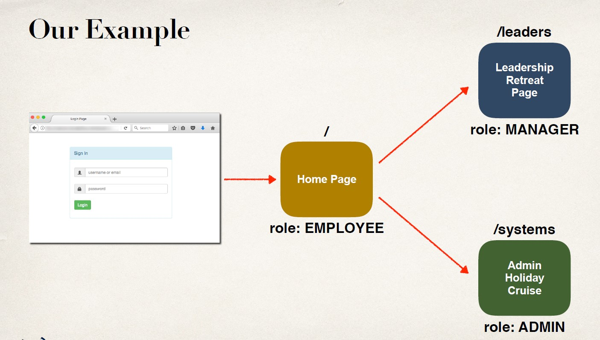
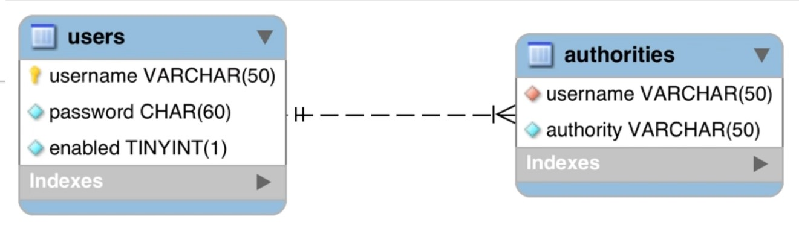
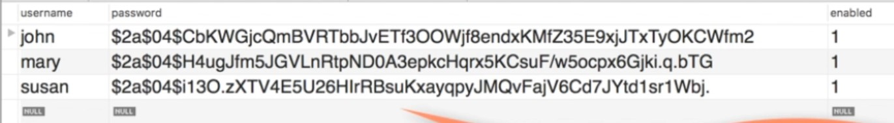
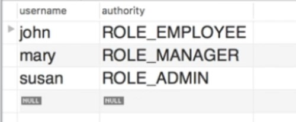

## Example 

- Example here shows , pages are differentiated on the basis of the role provided to the user.

## Tables 


## Stored data 



## Overview Of Developement 
- Instead of configuring Spring MVC app using XML
    - web.xml
    - spring-mvc-demo-servlet.xml
- Configure the Spring MVC app with Java code

## Process 
1. Add Maven dependencies for Spring MVCWeb App
2. Create Spring App Configuration (@Configuration)
3. Create Spring Dispatcher Servlet Initializer
4. Develop our Spring controller
5. Develop our JSP view page

## Dependencies (Artifacts)
1. spring
2. javax.servlet-api
3. springjstl
4. javax.servlet.jsp-api

## pom.xml
```xml
<!-- Spring MVC support -->
<!-- Will load all supporting dependencies spring-core,logging etc.-->
<dependency>
    <groupId>org.springframework</groupId>
    <artifactId>spring-webmvc</artifactId>
    <version>...</version>
</dependency>

<!-- Servlet, JSP and JSTL support -->
<dependency>
    <groupId>javax.servlet</groupId>
    <artifactId>javax.servlet-api</artifactId>
    <version>...</version>
</dependency>
<dependency>
    <groupId>javax.servlet.jsp</groupId>
    <artifactId>javax.servlet.jsp-api</artifactId>
    <version>...</version>
</dependency>
<dependency>
    <groupId>javax.servlet</groupId>
    <artifactId>jstl</artifactId>
    <version>...</version>
</dependency>
```

## Customize Maven Build
- Need to customize Maven build ,since we are not using web.xml
```xml
<build>
<pluginManagement>
    <plugins>
        <plugin>
            <!-- Add Maven coordinates (GAV) for: maven-war-plugin -->
            <groupId>org.apache.maven.plugins</groupId>
            <artifactId>maven-war-plugin</artifactId>
            <version>3.2.0</version>
        </plugin>
    </plugins>
</pluginManagement>
```

## XML config to Java config
- web.xml , spring-mvc-demo-servlet.xml
- Replaced with 
- `Spring @Configuration`
- `Spring Dispatcher,Servlet Initializer`

## Old way 
```xml
<beans>
    <!-- Add support for component scanning -->
    <context:component-scan base-package="com.luv2code.springdemo" />
    <!-- Add support for conversion, formatting and validation support -->
    <mvc:annotation-driven/>
    <!-- Define Spring MVC view resolver -->
    <bean
        class="org.springframework.web.servlet.view.InternalResourceViewResolver">
        <property name="prefix" value="/WEB-INF/view/" />
        <property name="suffix" value=".jsp" />
    </bean>
</beans>
```

## Enabling the MVC Java Config `@EnableWebMvc`
- Provides similar support to <mvc:annotation-driven /> in XML.
- Adds conversion, formatting and validation support
- Processing of `@Controller` classes and `@RequestMapping` etc ... methods

## DemoAppConfig.java
```Java
@Configuration

/// provides similar support to <mvc:annotation-driven />
@EnableWebMvc
@ComponentScan(basePackages="com.luv2code.springsecurity.demo")
public class DemoAppConfig {
    // define a bean for ViewResolver
    @Bean
    public ViewResolver viewResolver() {
        InternalResourceViewResolver viewResolver = new InternalResourceViewResolver();
        
        /// the absolute view name /WEB-INF/view/ show-student-list .jsp
        viewResolver.setPrefix("/WEB-INF/view/");
        viewResolver.setSuffix(".jsp");
        return viewResolver;
    }
}   
```

## web.xml ( Old Way )
```xml
<web-app>

<servlet>
    <servlet-name>dispatcher</servlet-name>
    <servlet-class>org.springframework.web.servlet.DispatcherServlet</servlet-class>

    <init-param>
        <param-name>contextConfigLocation</param-name>
        <param-value>/WEB-INF/spring-mvc-demo-servlet.xml</param-value>
    </init-param>

    <load-on-startup>1</load-on-startup>
</servlet>

<servlet-mapping>
    <servlet-name>dispatcher</servlet-name>
    <url-pattern>/</url-pattern>
</servlet-mapping>

</web-app>
```

## Web App Initializer
- Spring MVC provides support for web app initialization
- Makes sure your code is automatically detected
- Your code is used to initialize the servlet container
`AbstractAnnotationConfigDispatcherServletInitializer`
- Your TO DO list
    - Extend this abstract base class
    - Override required methods
    - Specify servlet mapping and location of your app config

## Step 3: Create Spring Dispatcher Servlet Intializer
**MySpringMvcDispatcherServletInitializer.java**
```Java
import org.springframework.web.servlet.support.AbstractAnnotationConfigDispatcherServletInitializer;
public class MySpringMvcDispatcherServletInitializer extends AbstractAnnotationConfigDispatcherServletInitializer {
    @Override
    protected Class<?>[] getRootConfigClasses() {
        // TODO Auto-generated method stub
        return null;
    }

    /*<servlet>
     *     <servlet-name>dispatcher</servlet-name>
     *     <servlet-class>org.springframework.web.servlet.DispatcherServlet</servlet-class>
     *
     *     <init-param>
     *         <param-name>contextConfigLocation</param-name>
     *         <param-value>/WEB-INF/spring-mvc-demo-servlet.xml</param-value>
     *     </init-param>
     *
     *     <load-on-startup>1</load-on-startup>
     *      </servlet>
     */
    @Override
    protected Class<?>[] getServletConfigClasses() {
        return new Class[] { DemoAppConfig.class };
    }

    /*
     *<servlet-mapping>
     *   <servlet-name>dispatcher</servlet-name>
     *  <url-pattern>/</url-pattern>
     *</servlet-mapping>
     */
    @Override
    protected String[] getServletMappings() {
        return new String[] { "/" };
    }
}
```

## Step 4: Spring Controller 
```Java
@Controller
public class DemoController {
    @GetMapping("/")
    public String showHome() {
        return "home";
    }
}
```

## Develop JSP page 
```html
<html>
    <body>
        Welcome to the luv2code company home page!
    </body>
</html>
```