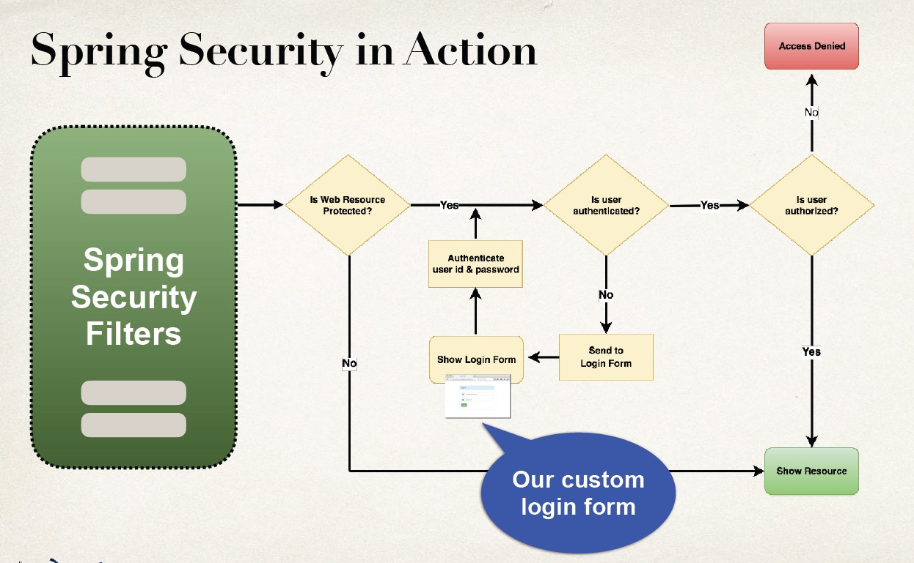

## Implementing Custom Login Form


## Developement Process
Development Process
- Modify Spring Security Configuration to reference custom login form
- Develop a Controller to show the custom login form
- Create custom login form
    - HTML (CSS optional)
    - Spring MVC form tag <form:form>

## Step 1: Modify Spring Security Configuration

|Method|Description|
|------|-----------|
|configure(AuthenticationManagerBuilder)|Configure users (in memory, database, ldap, etc)|
|configure(HttpSecurity)|Configure security of web paths in application, login, logout etc|

**DemoSecurityConfig.java**
```Java
@Configuration
@EnableWebSecurity
public class DemoSecurityConfig extends WebSecurityConfigurerAdapter {
    @Override
    protected void configure(AuthenticationManagerBuilder auth) throws Exception {
    // add our users for in memory authentication
    …
    }

    @Override
    protected void configure(HttpSecurity http) throws Exception { /// configure security of web paths in applications, login , logout etc. 
        http.authorizeRequests() /// restrict access based on the HttpServletRequest
        .anyRequest().authenticated() /// any request to the app must be authenticated(i.e logged in)
        .and()
        .formLogin() /// we are customizing the form login process 
        .loginPage("/showMyLoginPage") /// show our custom form at the request mapping "/showMyLoginPage"
        .loginProcessingUrl("/authenticateTheUser") /// Login form should POST data to this URL for processing (check user id and password)
        .permitAll(); /// Allow everyone to see login page. No need to logged in . 
    }
}
```
- We can give any name to the loginPage and loginProcessingUrl, as long as we stay consistent with the project. 
- To Do : 
    - We need to create a controller for this request mapping `/showMyLoginPage`.
    - No controller mapping required for `/authenticateTheUser` (provided by default by the spring)
     

## Step 2: Develop a controller to show the custom login form
**LoginController.java**
```Java
@Controller
public class LoginController {

    @GetMapping("/showMyLoginPage")
    public String showMyLoginPage() {
        return "plain-login";
    }
}
```
- To do : 
    - We need to create `plain-login.jsp`

## Create Custom login form
- Send data to login processing URL: /authenticateTheUser
    - Must POST the data
- Login processing URL will be handled by Spring Security Filters
- You get it for free … no coding required
- Best practice is to use the Spring MVC Form tag `<form:form>`
    - Provides automatic support for security defenses (more on this later)
- Spring Security defines default names for login form fields
```
User name field: username
Password field: password
```
```html
<%@ taglib prefix="form" uri="http://www.springframework.org/tags/form" %>
…
<form:form action="${pageContext.request.contextPath}/authenticateTheUser" method="POST">
    <p>
        User name: <input type="text" name="username" />
    </p>
    <p>
        Password: <input type="password" name="password" />
    </p>
    <input type="submit" value="Login" />
</form:form>
```
## Why use context path
- Allows us to dynamically reference context path of application
- Helps to keep links relative to application context path
- If you change context path of app, then links will still work
- Much better than hard-coding context path …
- Best Practice