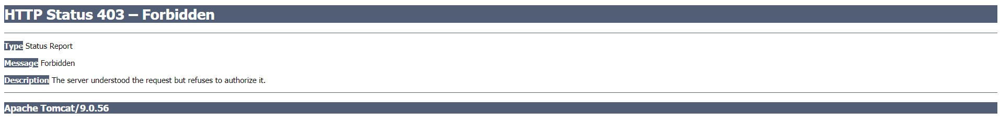

## Intro
- Spring Security protects against Cross-Site Request Forgery (CSRF)
- C-SRF ( *pronounced* : C surf) is a type of attack, where in  an evil website
tricks you into executing an action on a web application that you are currently logged in.

## Scenerios
-  You are logged into your banking app
    - tricked into sending money to another person
- You are logged into an e-commerce app
    - tricked into purchasing unwanted items


## Solutions 
- To protect against CSRF attacks
- Embed additional authentication data/token into all HTML forms
- On subsequent requests, web app will verify token before processing

## Spring Security's CSRF protection 
- CSRF protection is enabled by default in Spring Security
- Spring Security uses the Synchronizer Token Pattern
    - Each request includes a session cookie and randomly generated token
- For request processing, Spring Security verifies token before processing
- All of this is handled by Spring Security Filters

## Architecture 


## When to use CSRF Protection?
- The Spring Security team recommends
- Use CSRF protection for any normal browser web requests
- If you are building a service for non-browser clients
- you may want to disable CSRF protection (after careful review)

## Use Spring Security CSRF Protection
- For form submissions use POST instead of GET
- Include CSRF token in form submission
- <form:form> automagically adds CSRF token
- If you don’t use <form:form>, you must manually add CSRF token

## Manually add CSRF token
```html
<form action="..." method="POST">
    <input type="hidden"
    name="${_csrf.parameterName}"
    value="${_csrf.token}" />
</form>
```

## What happens if you don’t include CSRF token?


## CSRF Resources
- CSRF Security Reference
    - [](https://www.owasp.org/index.php/Cross-Site_Request_Forgery_)
- Spring Security CSRF Support
    - [](https://docs.spring.io/spring-security/site/docs/current/reference/htmlsingle/#csrf)