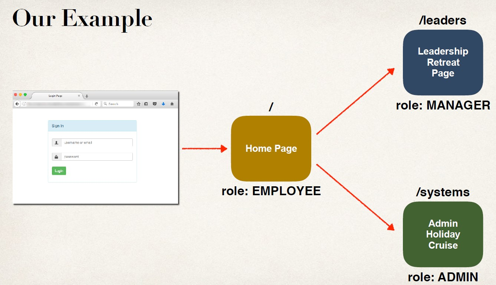
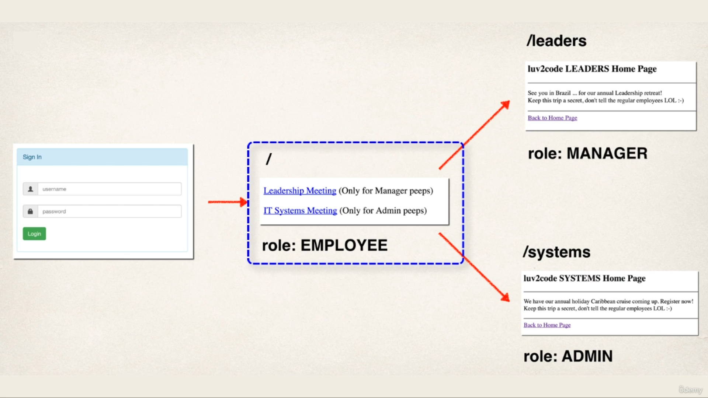

## Intro


## Developement Process
1. Create supporting controller code and view pages
2. Update user roles
3. Restrict Access based on Roles

## Step 2: Update Our User Roles
|User| ID |Password Roles|
|----|----|--------------|
|john |test123 |EMPLOYEE        |
|mary |test123 |EMPLOYEE, MANAGER|
|susan| test123| EMPLOYEE, ADMIN|

**DemoSecurityConfig.java**
```Java
@Override
protected void configure(AuthenticationManagerBuilder auth) throws Exception {
    // add our users for in memory authentication
    UserBuilder users = User.withDefaultPasswordEncoder();
    auth.inMemoryAuthentication()
        .withUser(users.username("john").password("test123").roles("EMPLOYEE"))
        .withUser(users.username("mary").password("test123").roles("EMPLOYEE", "MANAGER"))
        .withUser(users.username("susan").password("test123").roles("EMPLOYEE", "ADMIN"));
}
```
## Step 3: Restricting Access to Roles
- Update your Spring Security Java configuration file (.java)
- General Syntax
```Java
antMatchers(<< add path to match on >>).hasRole(<< authorized role >>)
```
- Any Role in the List
```Java
antMatchers(<< add path to match on >>).hasAnyRole(<< list of authorized roles (any role in the list, comma delimited list) >>)
```
- Example
```Java
antMatchers("/").hasRole("EMPLOYEE")

/// Restrict Path/Leaders to MANAGER
/// match on path: /leaders And all sub directories(**)
antMatchers("/leaders/**").hasRole("MANAGER")

/// Restrict Path /systems to ADMIN
/// match on path: /systems and all sub directories(**)
antMatchers("/systems/**").hasRole("ADMIN")
```

## Pull it together 
```Java
@Override
protected void configure(HttpSecurity http) throws Exception {
    http.authorizeRequests()
    .antMatchers("/").hasRole("EMPLOYEE")
    .antMatchers("/leaders/**").hasRole("MANAGER")
    .antMatchers("/systems/**").hasRole("ADMIN")
    .and()
    .formLogin()
    …
}
```

## Expectations


## Creating Custom Access Denied Page
1. Configure custom page for access denied
2. Create supporting controller code and view page

## Step 1: Configure custom page access denied
```Java
@Override
protected void configure(HttpSecurity http) throws Exception {
    …
    .and()
    .exceptionHandling()
    .accessDeniedPage(“/access-denied”);
}
```
