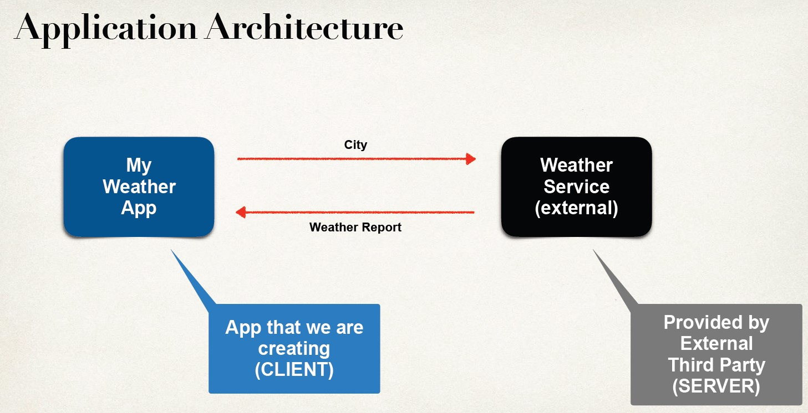

## Intro 
- Create REST api's / web services with spring. 

## Application Architecture

## Questions 
Questions
- How will we connect to the Weather Service?
    - How will we connect to the Weather Service?
    - We can make REST API calls over HTTP
    - REST: REpresentational State Transfer
    - Lightweight approach for communicating between applications
- What programming language do we use?
    - REST is language independent
    - The client application can use ANY programming language
    - The server application can use ANY programming language
- What is the data format
    - REST applications can use any data format
    - Commonly see XML and JSON
    - JSON is most popular and modern
    - JavaScript Object Notation

## Generally Same terms
- REST API
- RESTful API
- REST Web Services
- RESTful Web Services
- REST Services
- RESTful Services