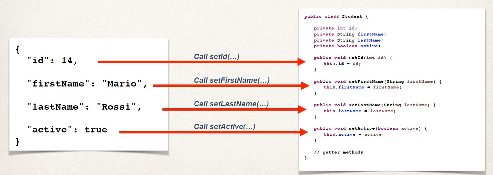

## What is JSON?
- JavaScript Object Notation
- Lightweight data format for storing and exchanging data … plain text
- Language independent … not just for JavaScript
- Can use with any programming language: Java, C#, Python etc…
- Ex
```json
{
    "id": 14,
    "firstName": "Mario",
    "lastName": "Rossi",
    "active": true
}
```

## JSON values
- JSON Values
- Numbers: no quotes
- String: in double quotes
- Boolean: **true**, **false**
- Nested JSON object
- Array
- **null**

## Nested JSON Objects
```json
{
    "id": 14,
    "firstName": "Mario",
    "lastName": "Rossi",
    "active": true,
    "address" : {
        "street" : "100 Main St",
        "city" : "Philadelphia",
        "state" : "Pennsylvania",
        "zip" : "19103",
        "country" : "USA"
    }
}
```

## JSON Array 
```json
{
    "id": 14,
    "firstName": "Mario",
    "lastName": "Rossi",
    "active": true,
    "languages" : ["Java", "C#", "Python", "Javascript"]
}
```

## JSON Data Binding
- Data binding is the process of converting JSON data to a Java POJO
- Also known as **Mapping**, **Serialization / Deserialization** and **Marshalling / Unmarshalling**. 
- JSON Data Binding with Jackson
- Spring uses the `Jackson Project` behind the scenes
- Jackson handles data binding between JSON and Java POJO
- Jackson Project [github link](https://github.com/FasterXML/jackson-databind)

## Jackson Data Binding
- Jackson Data Binding API
- Package: com.fasterxml.jackson.databind
- Maven Dependency
```xml
<dependency>
    <groupId>com.fasterxml.jackson.core</groupId>
    <artifactId>jackson-databind</artifactId>
    <version>2.9.0</version>
</dependency>
```
- By default, Jackson will call appropriate getter/setter method

## Convert JSON to JAVA pojo
- Convert JSON to Java POJO … call setter methods on POJO
- 
- Jackson calls the setXXX methods 
- It does NOT access internal private fields directly

## Code Example 
```Java
import java.io.File;
import com.fasterxml.jackson.databind.ObjectMapper;
public class Driver {
    public static void main(String[] args) throws Exception {
        // create object mapper
        ObjectMapper mapper = new ObjectMapper();
        
        // read JSON from file and map/convert to Java POJO
        Student myStudent = mapper.readValue(new File("data/sample.json"), Student.class);
        
        // also print individual items
        System.out.println("First name = " + myStudent.getFirstName());
        System.out.println("Last name = " + myStudent.getLastName());
    }
}
```
## Output 
```
First name = Mario
Last name = Rossi
```

## Java POJO to JSON
- Convert Java POJO to JSON … call getter methods on POJO
```Java
// create object mapper
ObjectMapper mapper = new ObjectMapper();

// read JSON from file and map/convert to Java POJO
Student myStudent = mapper.readValue(new File("data/sample.json"), Student.class);
...
// now write JSON to output file

/// Indent the JSON output for "pretty printing"
mapper.enable(SerializationFeature.INDENT_OUTPUT);

/// Jackson calls the getter methods on Student POJO to create JSON output file
mapper.writeValue(new File("data/output.json"), myStudent);
```

## Output
```json
{
    "id": 14,
    "firstName": "Mario",
    "lastName": "Rossi",
    "active": true
}
```

## Spring and Jackson Support
- When building Spring REST applications
- Spring will automatically handle Jackson Integration
- JSON data being passed to REST controller is converted to POJO
- Java object being returned from REST controller is converted to JSON
- Happens automatically behind the scenes


## Implementation
**Address.java**
```Java
package com.luv2code.jackson.json.demo;

public class Address {
	private String street; 
	private String city; 
	private String state; 
	private String zip; 
	private String country; 
	
	public Address() {
		
	}

	public String getStreet() {
		return street;
	}

	public void setStreet(String street) {
		this.street = street;
	}

	public String getCity() {
		return city;
	}

	public void setCity(String city) {
		this.city = city;
	}

	public String getState() {
		return state;
	}

	public void setState(String state) {
		this.state = state;
	}

	public String getZip() {
		return zip;
	}

	public void setZip(String zip) {
		this.zip = zip;
	}

	public String getCountry() {
		return country;
	}

	public void setCountry(String country) {
		this.country = country;
	}

}
```

**Student.java**
```Java
package com.luv2code.jackson.json.demo;

import com.fasterxml.jackson.annotation.JsonIgnoreProperties;

@JsonIgnoreProperties(ignoreUnknown=true)
public class Student {
	private int id; 
	private String firstName; 
	private String lastName; 
	private boolean active; 
	private Address address; 
	private String languages[];
	


	public Student() {}

	public int getId() {
		return id;
	}

	public void setId(int id) {
		this.id = id;
	}

	public String getFirstName() {
		return firstName;
	}

	public void setFirstName(String firstName) {
		this.firstName = firstName;
	}

	public String getLastName() {
		return lastName;
	}

	public void setLastName(String lastName) {
		this.lastName = lastName;
	}

	public boolean isActive() {
		return active;
	}

	public void setActive(boolean active) {
		this.active = active;
	}
	
	public Address getAddress() {
		return address;
	}

	public void setAddress(Address address) {
		this.address = address;
	}
	
	public String[] getLanguages() {
		return languages;
	}

	public void setLanguages(String[] languages) {
		this.languages = languages;
	}
}

```

**Driver.java**
```Java
package com.luv2code.jackson.json.demo;

import java.io.File;

import com.fasterxml.jackson.databind.ObjectMapper;

public class Driver {

	public static void main(String[] args) {
		try {
			
			// create object mapper 
			ObjectMapper mapper = new ObjectMapper();
			
			
			// read JSON file and map/convert to Java POJO : data/sample-lite.json
			// Student theStudent = mapper.readValue(new File("data/sample-lite.json"), Student.class);
			Student theStudent = mapper.readValue(new File("data/sample-full.json"), Student.class);
			
			// print first name and last name 
			System.out.println("First Name: " +theStudent.getFirstName());
			System.out.println("Last Name: " + theStudent.getLastName());
			
			// print out the address: street and city
			Address tempAddress = theStudent.getAddress();
			System.out.println("Street: " + tempAddress.getStreet());
			System.out.println("City: " + tempAddress.getCity());
			
			// print out languages
			for(String tempLang: theStudent.getLanguages()) {
				System.out.println(tempLang);
			}
		}
		catch(Exception exc) {a
			exc.printStackTrace();
		}

	}

}

```
**sample-full.json**
```json
{
	"id": 14,
	"firstName": "Mario",
	"lastName": "Rossi",
	"active": true,
	"address": {
		"street": "100 Main St",
		"city": "Philadelphia",
		"state": "Pennsylvania",
		"zip": "19103",
		"country": "USA"
	},
	"languages" : ["Java", "C#", "Python", "Javascript"],
	"company":"Acme Inc"
}
```
**sample-lite.json**
```json
{
	"id": 14,
	"firstName": "Mario",
	"lastName": "Rossi",
	"active": true
}
```