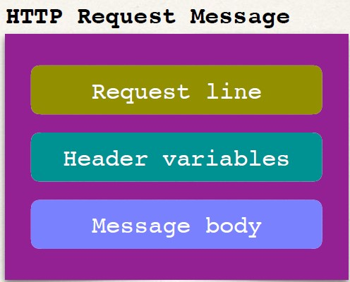
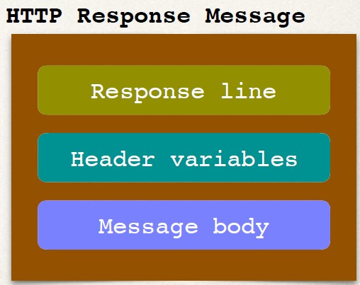

## REST http 
- Most common use of REST is over HTTP
- Leverage HTTP methods for CRUD operations

|HTTP Method|CRUD Operation|
|-----------|--------------|
|POST| Create a new entity|
|GET| Read a list of entities or single entity|
|PUT| Update an existing entity|
|DELETE|Delete an existing entity|

## Architecture 
```
[Client]        HTTP Request Method           [Server]
   My------------------------------------------>CRM
  CRM                                           Rest
  App <----------------------------------------Service
                HTTP Response Method
```

## HTTP Request Method
- Request line: the HTTP command
- Header variables: request metadata
- Message body: contents of message



## HTTP Response Method 
- Response line: server protocol and status code
- Header variables: response metadata
- Message body: contents of message



## HTTP Response - Status Codes
|Code - Range| Description|
|------------|------------|
|100 - 199| Informational|
|200 - 299 |Successful|
|300 - 399 |Redirection|
|400 - 499 |Client error|
|500 - 599 |Server error|

## Examples 
- 401 Authentication Required
- 404 File Not Found
- 500 Internal Server Error

## MIME Content Types
- The message format is described by MIME content type
    - Multipurpose Internet Mail-Extension
- Basic Syntax: type/sub-type
- Examples
    - text/html, text/plain
    - application/json, application/xml, …

## Client Tool
- We need a client tool
- Send HTTP requests to the RESTWeb Service / API
- Plenty of tools available: curl, Postman, etc…
- In our part we would be using POSTMAN