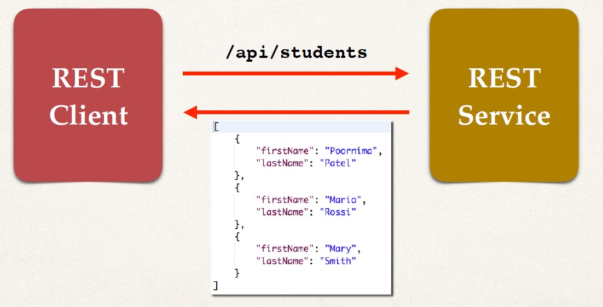

## Spring REST Support
- Spring Web MVC provides support for Spring REST
- New annotation @RestController
    - Extension of @Controller
    - Handles REST requests and responses
- Spring REST will also automatically convert Java POJOs to JSON
    - As long as the Jackson project is on the classpath or pom.xml

## Spring REST Hello World 
```
        /test/hello
REST ----------------------> REST
Client<-------------------- Service
            Hello WOrld!
```

## Spring REST Controller
```Java
/// Adds REST support
@RestController
@RequestMapping("/test")
public class DemoRestController {
    
    /// Access the REST endpoint at /test/hello
    @GetMapping("/hello")
    public String sayHello() {


        /// Returns content to client
        return "Hello World!";
    }
}
```

## Web Browser vs Postman
- For simple REST testing for GET requests
    - Web Browser and Postman are similar
- However, for advanced REST testing: POST, PUT etc…
    - Postman has much better support
    - POSTing JSON data, setting content type
    - Passing HTTP request headers, authentication etc…

## Development Process
1. Add Maven dependency for Spring MVC and Jackson project
2. Add code for All Java Config: `@Configuration`
3. Add code for All Java Config: Servlet Initializer
4. Create Spring REST Service using `@RestController`

## Step 1: Add Maven Dependencies
**pom.xml**
```xml
<!-- Add Spring MVC and REST support -->
<dependency>
    <groupId>org.springframework</groupId>
    <artifactId>spring-webmvc</artifactId>
    <version>...</version>
</dependency>

<!-- Add Jackson for JSON converters -->
<dependency>
    <groupId>com.fasterxml.jackson.core</groupId>
    <artifactId>jackson-databind</artifactId>
    <version>...</version>
</dependency>

<!-- Add Servlet support for Spring's AbstractAnnotationConfigDispatcherServletInitializer -->
<dependency>
    <groupId>javax.servlet</groupId>
    <artifactId>javax.servlet-api</artifactId>
    <version>...</version>
</dependency>
```

## Step 2: All Java Config: @Configuration
**DemoAppConfig.java**
```Java
@Configuration
@EnableWebMvc
@ComponentScan(basePackages="com.luv2code.springdemo")
public class DemoAppConfig {
}
```
## Web App Initializer
- Spring MVC provides support for web app initialization
- Makes sure your code is automatically detected
- Your code is used to initialize the servlet container
`AbstractAnnotationConfigDispatcherServletInitializer`
- Your TO DO list
    - Extend this abstract base class
    - Override required methods
    - Specify servlet mapping and location of your app config

## Step 3: All Java Config: Servlet Initializer
**MySpringMvcDispatcherServletInitializer.java**
```Java
import org.springframework.web.servlet.support.AbstractAnnotationConfigDispatcherServletInitializer;
public class MySpringMvcDispatcherServletInitializer extends AbstractAnnotationConfigDispatcherServletInitializer {
    @Override
    protected Class<?>[] getRootConfigClasses() {
        // TODO Auto-generated method stub
        return null;
    }
    
    @Override
    protected Class<?>[] getServletConfigClasses() {
        return new Class[] { DemoAppConfig.class };
    }
    
    @Override
    protected String[] getServletMappings() {
        return new String[] { "/" };
    }
}
```

## Step 4: Create Spring REST Service
```Java
@RestController
@RequestMapping("/test")
public class DemoRestController {
    @GetMapping("/hello")
    public String sayHello() {
        return "Hello World!";
    }
}
```

## Creating a new Service 
- `GET` **/api/students** Returns a list of students


## Basic Architecture We Want 


## Convert Java POJO to JSON
- Our REST Service will return List<Student>
- Need to convert List<Student> to JSON
- Jackson can help us out with this…

## Spring and Jackson Support
- Spring will automatically handle Jackson integration
- As long as the Jackson project is on the classpath or pom.xml
- JSON data being passed to REST controller is converted to Java POJO
- Java POJO being returned from REST controller is converted to JSON
- Happens automatically behind the scenes

## Student POJO(class)
 {
    }
    
    public Student(String firstName, String lastName) {
        this.firstName = firstName;
        this.lastName = lastName;
    }
    public String getFirstName() {
        return firstName;
    }
    public void setFirstName(String firstName) {
        this.firstName = firstName;
    }
    public String getLastName() {
        return lastName;
    }
    public void setLastName(String lastName) {
        this.lastName = lastName;
    }
}
```

2. Create Spring REST Service using @RestController
-Jackson will convert List<Student> to JSON array
**StudentRestController.java**
```Java
@RestController
@RequestMapping("/api")
public class StudentRestController {

// define endpoint for "/students" - return list of students
@GetMapping("/students")
public List<Student> getStudents() {
        List<Student> theStudents = new ArrayList<>();
        theStudents.add(new Student("Poornima", "Patel"));
        theStudents.add(new Student("Mario", "Rossi"));
        theStudents.add(new Student("Mary", "Smith"));
        return theStudents;
    }
}
```