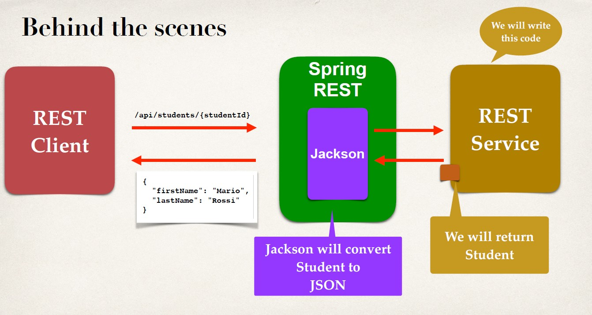
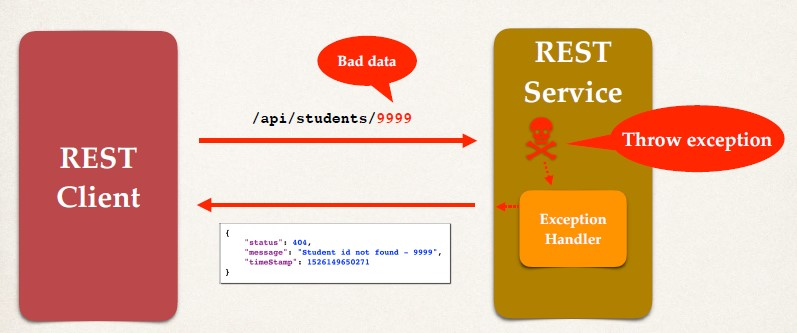
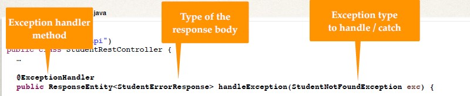
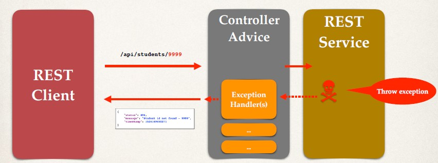

## Path Variables
- Retrieve a single student by id
- `GET` **/api/students/{studentId}** 
- **{studentId}** Known as a `path variable`
- Retrieve a single student
```
/api/students/0
/api/students/1
/api/students/2
```


## Behind the Scenes 


## Development Process
1. Add request mapping to Spring REST Service
    - Bind path variable to method parameter using `@PathVariable`

**StudentRestController.java**
```java
@RestController
@RequestMapping("/api")
public class StudentRestController {
    // define endpoint for "/students/{studentId}" - return student at index
    @GetMapping("/students/{studentId}")
    public Student getStudent(@PathVariable int studentId) {
        List<Student> theStudents = new ArrayList<>();
        // populate theStudents
        …
        return theStudents.get(studentId);
    }
}
```
## There might be an input which is not in the db 
- That's where exception handling comes into play 
- We instead of providing the exception details to the client. 
- We want server to provide a nice message returning the error. 
```json
{
    "status":404,
    "message":"Student id not found - 9999",
    "timestamp":1526146554545
}
```

## Architecture 



## Development Process
1. Create a custom error response class
2. Create a custom exception class
3. Update REST service to throw exception if student not found
4. Add an exception handler method using @ExceptionHandler

## Step 1: Create custom error response class
- The custom error response class will be sent back to client as JSON
- We will define as Java class (POJO)
- Jackson will handle converting it to JSON
```
StudentErrorResponse
--------------------
status : int
message : String 
timeStamp : long
--------------------
getStatus():int
setStatus(..):void
--------------------
```
**StudentErrorResponse.java**
```Java
public class StudentErrorResponse {
    private int status;
    private String message;
    private long timeStamp;

    // constructors

    // getters / setters
}
```

## Step 2: Create custom student exception
- The custom student exception will used by our REST service
- In our code, if we can't find student, then we'll throw an exception
- Need to define a custom student exception class
- `StudentNotFoundException`

**StudentNotFoundException.java**
```Java
public class StudentNotFoundException extends RuntimeException {
    public StudentNotFoundException(String message) {
        super(message);
    }
}
```

## Step 3: Update REST service to throw exception
- This only denotes the exception throwing. 
**StudentRestController.java**
```Java
@RestController
@RequestMapping("/api")
public class StudentRestController {

    @GetMapping("/students/{studentId}")
    public Student getStudent(@PathVariable int studentId) {
    
    // check the studentId against list size
    if ( (studentId >= theStudents.size()) || (studentId < 0) ) {
        throw new StudentNotFoundException("Student id not found - " + studentId);
    }
    return theStudents.get(studentId);
    }
}
```

## Step 4: Add exception handler method
- Define exception handler method(s) with @ExceptionHandler annotation
- Exception handler will return a ResponseEntity
- ResponseEntity is a wrapper for the HTTP response object
- ResponseEntity provides fine-grained control to specify

**StudentRestController.java**


```Java
@RestController
@RequestMapping("/api")
public class StudentRestController {
    …
    @ExceptionHandler
    public ResponseEntity<StudentErrorResponse> handleException(StudentNotFoundException exc) {
        
        StudentErrorResponse error = new StudentErrorResponse();
        
        error.setStatus(HttpStatus.NOT_FOUND.value());
        error.setMessage(exc.getMessage());
        error.setTimeStamp(System.currentTimeMillis());
        

        /// error : Body
        /// HttpStatus.NOT_FOUND : Status Code
        return new ResponseEntity<>(error, HttpStatus.NOT_FOUND);
    }
}
```


## Adding generic exception handler
```Java
// add another exception handler ... to catch any exception (catch all)
	@ExceptionHandler
	public ResponseEntity<StudentErrorResponse> handleException(Exception exc){
		StudentErrorResponse error = new StudentErrorResponse();
		
		/// status code 400
		error.setStatus(HttpStatus.BAD_REQUEST.value());
		error.setMessage(exc.getMessage());
		error.setTimeStamp(System.currentTimeMillis());
		
		// return Response Entity
		return new ResponseEntity<>(error,HttpStatus.NOT_FOUND);
	}
}
```


## Global Exception Handling

## It works, but …
- Exception handler code is only for the specific REST controller
- Can't be reused by other controllers :-(
- We need global exception handlers
    - Promotes reuse
    - Centralizes exception handling

## Spring @ControllerAdvice
- `@ControllerAdvice` is similar to an interceptor / filter
- Pre-process requests to controllers
- Post-process responses to handle exceptions
- Perfect for global exception handling

## Architecture


## Development Process
1. Create new @ControllerAdvice
2. Refactor REST service… remove exception handling code
3. Add exception handling code to @ControllerAdvice


```Java
@ControllerAdvice
public class StudentRestExceptionHandler {
    …
    @ExceptionHandler
    public ResponseEntity<StudentErrorResponse> handleException(StudentNotFoundException exc) {
        
        StudentErrorResponse error = new StudentErrorResponse();
        
        error.setStatus(HttpStatus.NOT_FOUND.value());
        error.setMessage(exc.getMessage());
        error.setTimeStamp(System.currentTimeMillis());
        

        /// error : Body
        /// HttpStatus.NOT_FOUND : Status Code
        return new ResponseEntity<>(error, HttpStatus.NOT_FOUND);
    }
}
```

