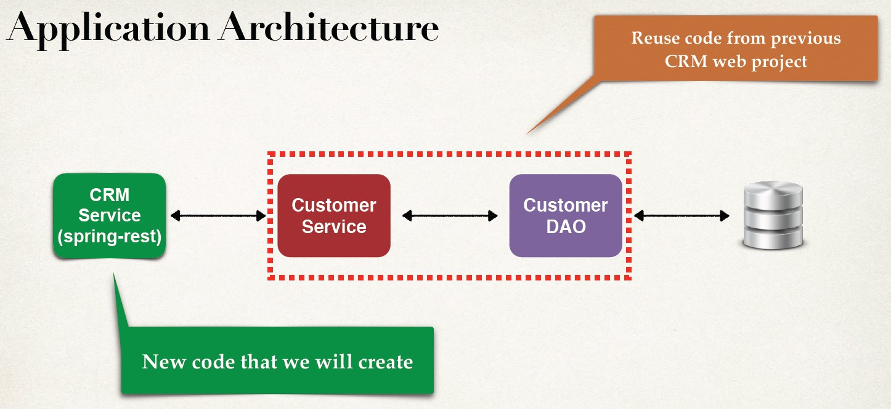
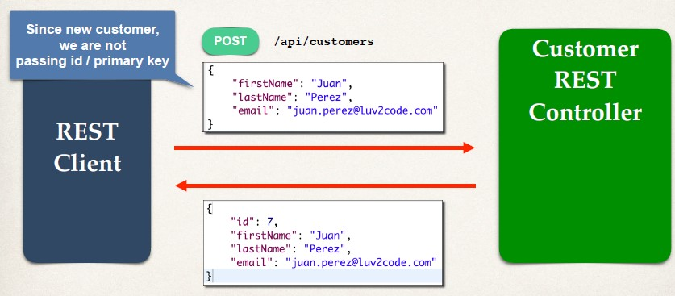
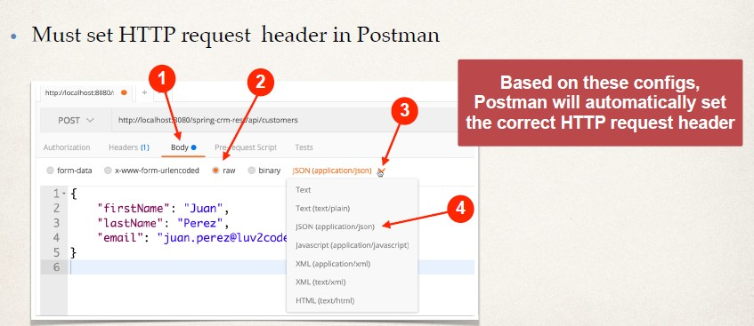
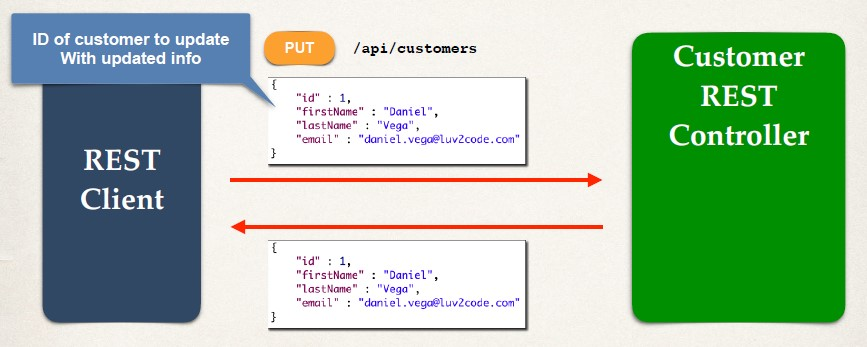
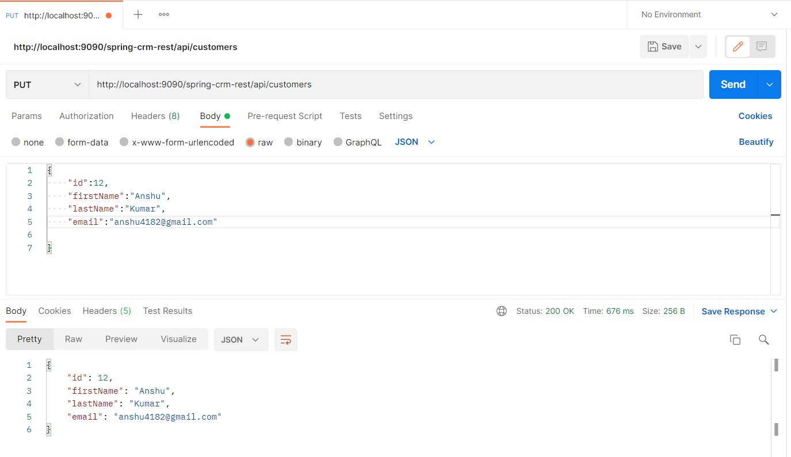
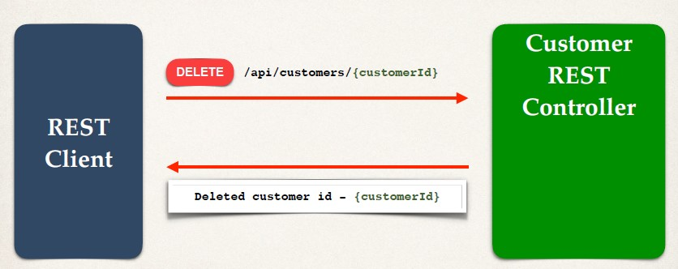
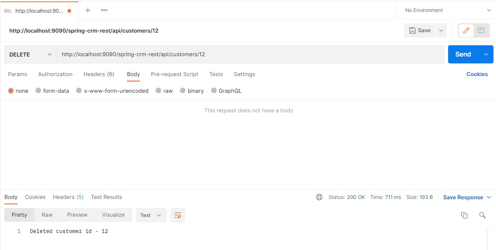
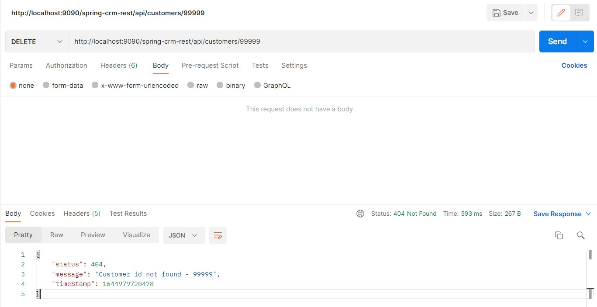

## CRUD Endpoint Examples
|HTTP Method| Endpoint |CRUD Action|
|-----------|----------|-----------|
|POST| /api/customers| Create a new customer|
|GET |/api/customers |Read a list of customers|
|GET |/api/customers/{customerId}| Read a single customer|
|PUT |/api/customers |Update an existing customer|
|DELETE| /api/customers/{customerId} |Delete an existing customer|

## Architecture


## Project Set Up
- We will download a Maven starter project
- Includes CustomerService, CustomerDAO and Customer entity
- We created all of this code already
- Allows us to focus on creating CRM REST Service

## Development Process
1. Get customers
2. Get single customer by ID
3. Add a new customer
4. Update an existing customer
5. Delete an existing customer


## Get Customers 
- Development Process
    1. Create Customer REST Controller
    2. Autowire CustomerService
    3. Add mapping for GET /customers

```Java
@RestController
@RequestMapping("/api")
public class CustomerRestController {
    
    // autowire the CustomerService
    @Autowired
    private CustomerService customerService;
        
        // add mapping for GET /customers
        @GetMapping("/customers")
        public List<Customer> getCustomers() {
            return customerService.getCustomers();
    }
}
```

## Get Single Customer
```Java
@RestController
@RequestMapping("/api")
public class CustomerRestController {
	
	// autowire the customer service 
	@Autowired
	private CustomerService customerService; 
	
    ....
	
	// add mapping for GET /customers/{customerId}
	@GetMapping("/customers/{customerId}")
	public Customer getCustomers(@PathVariable int customerId){
			return customerService.getCustomer(customerId);
	}
}

```
- One thing to note here , when we tried to break the api by giving calls to customerIds which are not even there in the db. 
- A blank page was recieved from server, which is an unexpected behaviour because as we have seen previously , it should return the Exception Package. 
- Why this unexpected behaviour happens? Reason is , our customerService.getCustomer( on an id which is not there in db) returns null. 
- Which is later used by jasckson. Jackson seeing NULL returns a blank page. 
- If you check the same in POSTMAN , you will find the blank, with the HTTP status, 200 Request OK. 

## Requirement 
- So we need to refactor our code. 
- It must return , HTTP 404, in the case customer is not found. 
- Even there has to be error handling for a scenerio where in a string is provided instead of int(i.e. datatype of customer id ). 


## These requirement can be fulfilled by `ControllerAdvice`
- Step one Generate an Exception(Custom) -- One new class needed `CustomerNotFoundException.java`
```java
package com.luv2code.springdemo.rest;

public class CustomerNotFoundException extends RuntimeException {

	public CustomerNotFoundException(String message, Throwable cause) {
		super(message, cause);
		
	}

	public CustomerNotFoundException(String message) {
		super(message);
		
	}

	public CustomerNotFoundException(Throwable cause) {
		super(cause);
		
	}

	public CustomerNotFoundException() {
		super();
		
	}

	public CustomerNotFoundException(String message, Throwable cause, boolean enableSuppression,
			boolean writableStackTrace) {
		super(message, cause, enableSuppression, writableStackTrace);
		
	}

}

```

- Step two : Handle that exception --- One new class needed `CustomerRestExceptionHandler.java`
```java
package com.luv2code.springdemo.rest;

import org.springframework.http.HttpStatus;
import org.springframework.http.ResponseEntity;
import org.springframework.web.bind.annotation.ControllerAdvice;
import org.springframework.web.bind.annotation.ExceptionHandler;

@ControllerAdvice
public class CustomerRestExceptionHandler {

	/// add an exception handler for CustomerNotFoundException
	@ExceptionHandler
	public ResponseEntity<CustomerErrorResponse> handleException(CustomerNotFoundException exc){
		
		CustomerErrorResponse error = new CustomerErrorResponse(HttpStatus.NOT_FOUND.value(),exc.getMessage(),System.currentTimeMillis());
		
		return new ResponseEntity<>(error,HttpStatus.NOT_FOUND); 
	}
	
	/// add another exception handler ... to catch any exception (catch all )
	@ExceptionHandler
	public ResponseEntity<CustomerErrorResponse> handleException(Exception exc){
		
		CustomerErrorResponse error = new CustomerErrorResponse(HttpStatus.BAD_REQUEST.value(),exc.getMessage(),System.currentTimeMillis());
		
		return new ResponseEntity<>(error,HttpStatus.BAD_REQUEST); 
	}

}
```
- Step three: I want to return the exception in pretty JSON object. -- again one class needed `CustomerErrorResponse.java`
```java
package com.luv2code.springdemo.rest;

public class CustomerErrorResponse {
	private int status; 
	private String message; 
	private long timeStamp; 
	
	public CustomerErrorResponse() {
		
	}

	public CustomerErrorResponse(int status, String message, long timeStamp) {
		this.status = status;
		this.message = message;
		this.timeStamp = timeStamp;
	}

	public int getStatus() {
		return status;
	}

	public void setStatus(int status) {
		this.status = status;
	}

	public String getMessage() {
		return message;
	}

	public void setMessage(String message) {
		this.message = message;
	}

	public long getTimeStamp() {
		return timeStamp;
	}

	public void setTimeStamp(long timeStamp) {
		this.timeStamp = timeStamp;
	}
	
	
	
	
}

```

- Generate custom Exception 
```java
// add mapping for GET /customers
@GetMapping("/customers/{customerId}")
public Customer getCustomers(@PathVariable int customerId){
		
		
			Customer theCustomer = customerService.getCustomer(customerId);
			if(theCustomer == null) {
				throw new CustomerNotFoundException("Customer id not found - "+customerId);
			}
			return theCustomer;
}
```

## Adding a customer



## Access the Request Body
- Jackson will convert request body from JSON to POJO
- `@RequestBody` annotation binds the POJO to a method parameter
```java
@PostMapping("/customers")
public Customer addCustomer(@RequestBody Customer theCustomer) {
    …
}
``` 
- Now we can access the request body as a POJO

## Implementation
**CustomerRestController.java**
```Java
@RestController
@RequestMapping("/api")
public class CustomerRestController {
    …
    // add mapping for POST /customers - add new customer
    @PostMapping("/customers")
    public Customer addCustomer(@RequestBody Customer theCustomer) {
        theCustomer.setId(0);
        customerService.saveCustomer(theCustomer);
        return theCustomer;
    }
}
```

## What’s up with customer id?
- In the REST controller, we explicitly set the customer id to 0
- Because our backend DAO code uses Hibernate method
- `session.saveOrUpdate(….)`
- This operation basically means 
```
if(primaryKey/id) emptu
then INSERT new customer
else UPDATE existing customer
```
- Here empty means `null` or `0`

## Adding customer with HTTP POST
- If REST client is sending a request to “add”, using HTTP POST
- Then we ignore any id sent in the request
- We overwrite the id with 0, to effectively set it to null/empty
- Then our backend DAO code will “INSERT” new customer
- ID of 0 means DAO code will “INSERT” new customer

## Sending JSON to Spring REST Controllers
- When sending JSON data to Spring REST Controllers
- For controller to process JSON data, need to set a HTTP request header
- Content-type: `application/json`
- Need to configure REST client to send the correct HTTP request header

## Postman - Sending JSON in request body


## HEADS UP - HTTP Status 405 ? Method Not Allowed
- If you encounter the following error message: `HTTP Status 405 ?` Method Not Allowed 
- Type Status Report Message Request method ‘POST’ not supported
- Description The method received in the request-line is known by the origin server but not supported by the target resource.
- You can resolve this by disabling CSRF with this code snippet: http.csrf().disable();
```java
    public class SecurityConfig extends WebSecurityConfigurerAdapter {
      ...
      protected void configure(HttpSecurity http){...}
      ...
        http.csrf().disable();
      ...
    }
```

## Output


## Update Customer

- `CustomerRestController.java`
```Java
@RestController
@RequestMapping("/api")
public class CustomerRestController {
    …
    // add mapping for PUT /customers - update existing customer
    @PutMapping("/customers")
    public Customer updateCustomer(@RequestBody Customer theCustomer) {
        customerService.saveCustomer(theCustomer);
        return theCustomer;
    }
}
```


## Delete Customer 

```Java
@DeleteMapping("/customers/{customerId}")
public String deleteCustomer(@PathVariable int customerId) {
    Customer tempCustomer = customerService.getCustomer(customerId);
    
    // throw exception if null
    if (tempCustomer == null) {
        throw new CustomerNotFoundException("Customer id not found - " + customerId);
    }
    
    customerService.deleteCustomer(customerId);
    return "Deleted customer id - " + customerId;
}


```


## Invalid Data Output 
