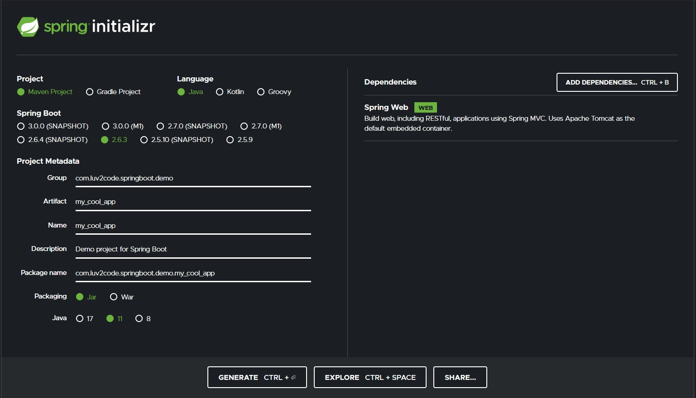
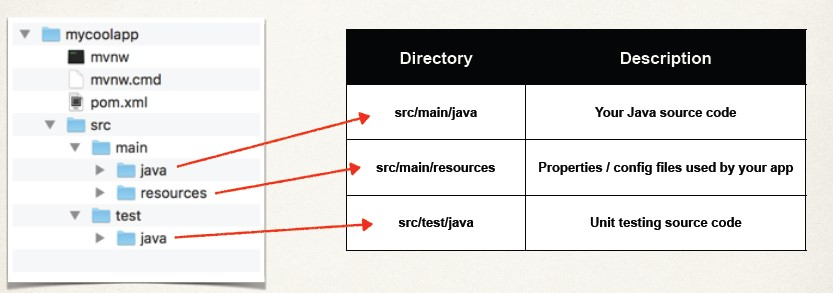
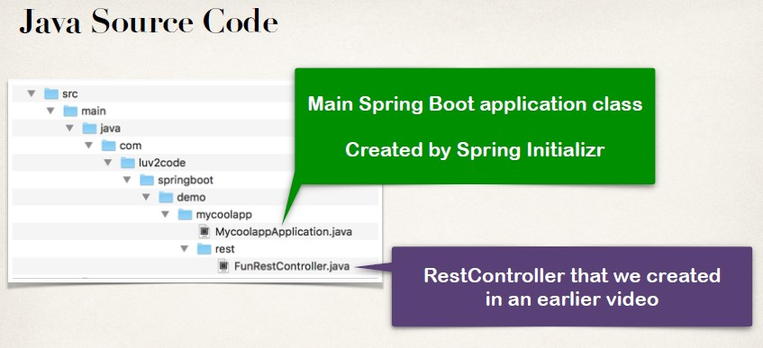
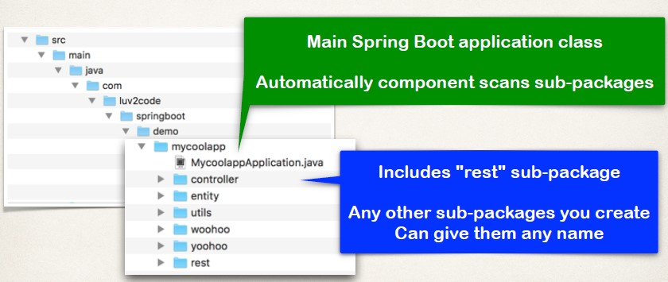
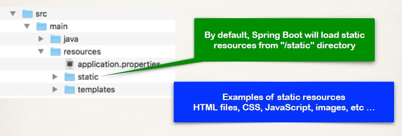
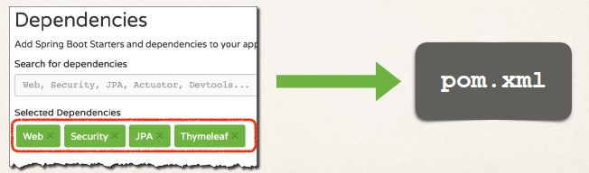
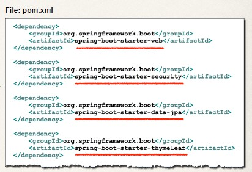
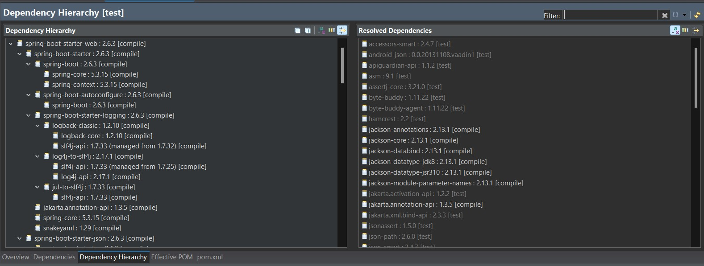

## Web Page

- Group : package name
- Artifact : Project name 
- Java version : is according to you. 
- Dependency: Spring WEB contains the basics


## Project Structure 


## Maven Wrapper files
- `mvnw` allows you to run a Maven project
    - No need to have Maven installed or present on your path
    - If correct version of Maven is NOT found on your computer
        - Automatically downloads correct version and runs Maven
-  Two files are provided
    - mvnw.cmd for MSWindows 
`mvnw clean compile test`
    - mvnw.sh for Linux/Mac
`./mvnw clean compile test`

- If you already have Maven installed previously
- Then you can ignore/delete the mvnw files
- Just use Maven as you normally would

## Maven POM file
- pom.xml includes info that you entered at Spring Initializr website


```xml
<dependency>
    <groupId>org.springframework.boot</groupId>
    <artifactId>spring-boot-starter-web</artifactId>
</dependency>
```
- Spring Boot Starters A collection of Maven dependencies (Compatible versions)
```
spring-web
spring-webmvc
hibernate-validator
tomcat
json
```
- To package executable jar or war archive Can also easily run the app
```xml
<build>
    <plugins>
        <plugin>
            <groupId>org.springframework.boot</groupId>
            <artifactId>spring-boot-maven-plugin</artifactId>
        </plugin>
    </plugins>
</build>
```
```
$ ./mvnw package
$ ./mvnw spring-boot:run
```

## Java Source code



**MycoolappApplication.java**
```Java
package com.luv2code.springboot.demo.mycoolapp;
import org.springframework.boot.SpringApplication;
import org.springframework.boot.autoconfigure.SpringBootApplication;
@SpringBootApplication
public class MycoolappApplication {
    public static void main(String[] args) {
        // Behind the scenes …
        // Creates application context
        // and registers all beans
        // Starts the embedded server
        // Tomcat etc…
        SpringApplication.run(MycoolappApplication.class, args);
    }
}
```

- `@SpringBootApplication` is composed of
```
@EnableAutoConfiguration
@ComponentScan
@Configuration
```

## Annotations
- `@SpringBootApplication` is composed of the following annotations

|Annotation| Description|
|----------|------------|
|@EnableAutoConfiguration | Enables Spring Boot's auto-configuration support|
|@ComponentScan | Enables component scanning of current package, Also recursively scans sub-packages|
|@Configuration |Able to register extra beans with @Bean or import other configuration classes|

## More on Component Scanning 
- Place your main application class in the root package above your other packages
- This implicitly defines a base search package
    - Allows you to leverage default component scanning
    - No need to explicitly reference the base package name

- Default scanning is fine if everything is under
    - com.luv2code.springboot.demo.mycoolapp
- But what about my other packages?
    - org.acme.iot.utils
    - edu.cmu.wean

```Java
package com.luv2code.springboot.demo.mycoolapp;
…
@SpringBootApplication(
    scanBasePackages={"com.luv2code.springboot.demo.mycoolapp",
                      "org.acme.iot.utils",
                      "edu.cmu.wean"})
public class MycoolappApplication {
…
}
```

## Application.properties 
- By default, Spring Boot will load properties from: application.properties (src/main/resources/application.properties)
- Can add Spring Boot properties 
`server.port=8585`
- Also add your own custom properties
`coach.name=Mickey Mouse`
`team.name=The Mouse Crew`

```Java
@RestController
public class FunRestController {
    
    @Value("${coach.name}")
    private String coachName;
    
    @Value("${team.name}")
    private String teamName;
    …
}
```

## Static Resources


## WARNING
- Do not use the src/main/webapp directory if your application is packaged as a JAR.
- Although this is a standard Maven directory, it works only with WAR packaging.
- It is silently ignored by most build tools if you generate a JAR

## Templates
- Spring Boot includes auto-configuration for following template engines
    - FreeMarker
    - Thymeleaf
    - Mustache
- Templates are loaded from `/src/main/resources/templates`

## Unit Tests
- Unit test can be added to the 
`/src/test/java/com.luv2code.springboot.demo.mycoolapp/MycoolappApplicationTests.java`

## Spring Starters 
- Spring  is hard 
    - It would be great if there was a simple list of Maven dependencies
    - Collected as a group of dependencies … one-stop shop
    - So I don't have to search for each dependency

- Spring Boot Starters
    - A curated list of Maven dependencies
    - A collection of dependencies grouped together
    - Tested and verified by the Spring Development team
    - Makes it much easier for the developer to get started with Spring
    - Reduces the amount of Maven configuration

- Spring Boot provides: spring-boot-starter-web
- Save's the developer from having to list all of the individual dependencies 
- Also, makes sure you have compatible versions

## Spring Initializr
- In Spring Initializr, simply select Web dependency
- You automatically get spring-boot-starter-web in pom.xml
- If we are building a Spring app that needs: Web, Security, …
- Simply select the dependencies in the Spring Initializr
- It will add the appropriate Spring Boot starters to your pom.xml





## Spring Boot Starters 
- There are 30+ Spring Boot Starters from the Spring Development team

|Name| Description|
|----|------------|
|spring-boot-starter-web| Building web apps, includes validation, REST.
Uses Tomcat as default embedded server|
|spring-boot-starter-security| Adding Spring Security support|
|spring-boot-starter-data-jpa| Spring database support with JPA and Hibernate|

- [Full List of Starters](https://www.luv2code.com/spring-boot-starters)


## What is in Starters ? 
- View the starter's POM file
    - Normally references other starters … so you will need to dig a bit
    - Somewhat cumbersome …
- Most IDEs have a Dependency Management / View feature
- Much easier to navigate
- For Eclipse Users
- Open the pom.xml
- Select the tab Dependency Hierarchy
- Expand the desired starter

- For IntelliJ users
    - Select `View > Tool Windows > Maven Projects > Dependencies`

## Spring Boot Starter Parent
- Spring Boot Starter Parent
- Spring Boot provides a "Starter Parent"
- This is a special starter that provides Maven defaults
    - Default compiler level (currently Java 8)
    - UTF-8 source encoding
```xml
<parent>
    <groupId>org.springframework.boot</groupId>
    <artifactid>spring-boot-starter-parent</artifactId>
    <version>2.1.0.RELEASE</version>
    <relativePath/>
</parent>
```
- To override a default, set as a property
```xml
<parent>
...
</parent>
<properties>
    <java.version>12</java.version>
</properties>
```
- For the spring-boot-starter-* dependencies, no need to list version
```xml
<parent>
...
</parent>
<dependencies>
    <dependency>
        <groupId>org.springframework.boot</groupId>
        <artifactId>spring-boot-starter-web<artifactId>
    </dependency>

    <dependency>
        <groupId>org.springframework.boot</groupId>
        <artifactId>spring-boot-starter-security<artifactId>
    </dependency>
```
- Default configuration of Spring Boot plugin `mvn spring-boot:run`
```xml
<build>
    <plugins>
        <plugin>
            <groupId>org.springframework.boot</groupId>
            <artifactId>spring-boot-maven-plugin</artifactId>
        </plugin>
    </plugins>
</build>
```

## Benefits of the Spring Boot Starter Parent
- Default Maven configuration: Java version, UTF-encoding etc
- Dependency management
    - Use version on parent only
    - spring-boot-starter-* dependencies inherit version from parent
- Default configuration of Spring Boot plugin