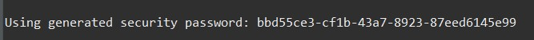

## Actuators
- How can I monitor and manage my application?
- How can I check the application health?
- How can I access application metrics

## Solution: Spring Boot Actuator
- Exposes endpoints to monitor and manage your application
- You easily get DevOps functionality out-of-the-box
- Simply add the dependency to your POM file
- REST endpoints are automatically added to your applicatio
- No need to write additional code! ,You get new REST endpoints for FREE!

## Adding the dependency to your POM file
```xml
<dependency>
        <groupId>org.springframework.boot</groupId>
        <artifactId>spring-boot-starter-actuator<artifactId>
</dependency>
```

- Automatically exposes endpoints for metrics out-of-the-box
- Endpoints are prefixed with: /actuator

|Name| Description|
|----|------------|
|/health| Health information about your application|
|/info| Information about your application|
|/auditevents| Audit events for your application|
|/beans| List of all beans registered in the Spring application context|
|/mappings |List of all @RequestMapping paths|

- Find the full list at [Link](www.luv2code.com/actuator-endpoints)

**Recent Updates**
- /info endpoint is not exposed by default 
You have to manualy expose it and also enable custom application info properties 
Here are the steps: 
1. Edit application.properties
2. Add following entries
```
management.endpoints.web.exposure.include=health,info
management.info.env.enabled=true
```

## Health Endpoint
- /health checks the status of your application
- Normally used by monitoring apps to see if your app is up or down
- Shows `{"status":"UP"}` , and is customizable based on your business logic

## Info Endpoint
- /info gives information about your application
- Default is empty
- `{}`
- Update application.properties with your app info
**src/main/resources/application.properties**
```
info.app.name=My Super Cool App
info.app.description=A crazy and fun app, yoohoo!
info.app.version=1.0.0
```
```json
{
    "app":{
        "name":"My Super Cool App",
        "description":"A crazy and fun app, yoohoo!",
        "version":"1.0.0"
    }
}
```
- To expose all actuator endpoints over HTTP
**src/main/resources/application.properties**
```
# Use wildcard "*" to expose all endpoints
# Can also expose individual endpoints with a comma-delimited list
#
management.endpoints.web.exposure.include=*
```

## Get A List of Beans
- Access `http://localhost:8080/actuator/beans`

## Development Process
1. Edit pom.xml and add spring-boot-starter-acuator
2. View actuator endpoints for: /health and /info
3. Edit application.properties to customize /info

`http://localhost:8080/actuator/mappings` : Gives all the mapping available
`http://localhost:8080/actuator/beans`: Gives all the beans registered
`http://localhost:8080/actuator/threaddump` : Gives all the threads being used. 

## Security
- You may NOT want to expose all of this information
- Add Spring security to project and endpoints are secured
```xml
<dependency>
        <groupId>org.springframework.boot</groupId>
        <artifactId>spring-boot-starter-security<artifactId>
</dependency>
```

## Secured Enpoints
- Now when you access: `/actuator/beans`
- Spring Security will prompt for login
- Default User name : `user`
- Security password would be generated on console  

- You can override default user name and generated password
**src/main/resources/application.properties**
```
spring.security.user.name=scott
spring.security.user.password=tiger
```

## Customizing using Spring Security
- You can customize Spring Security for Spring Boot Actuator
- Use a database for roles, encrypted passwords etc …
- Follow the same techniques as regular Spring Security
```java
public class DemoSecurityConfig extends WebSecurityConfigurerAdapter {
    @Autowired
    private DataSource securityDataSource;
    
    @Override
    protected void configure(AuthenticationManagerBuilder auth) throws Exception {
        auth.jdbcAuthentication().dataSource(securityDataSource);
    }
…
}
```

```java
@Override
protected void configure(HttpSecurity http) throws Exception {
http.authorizeRequests()
    .antMatchers("/actuator/**").hasRole("ADMIN")
…
}
```

- [For more details on Actuators](www.luv2code.com/actuator-docs)

## Development Process
1. Edit pom.xml and add spring-boot-starter-security
2. Verify security on actuator endpoints for: /beans etc
3. Disable endpoints for /health and /info