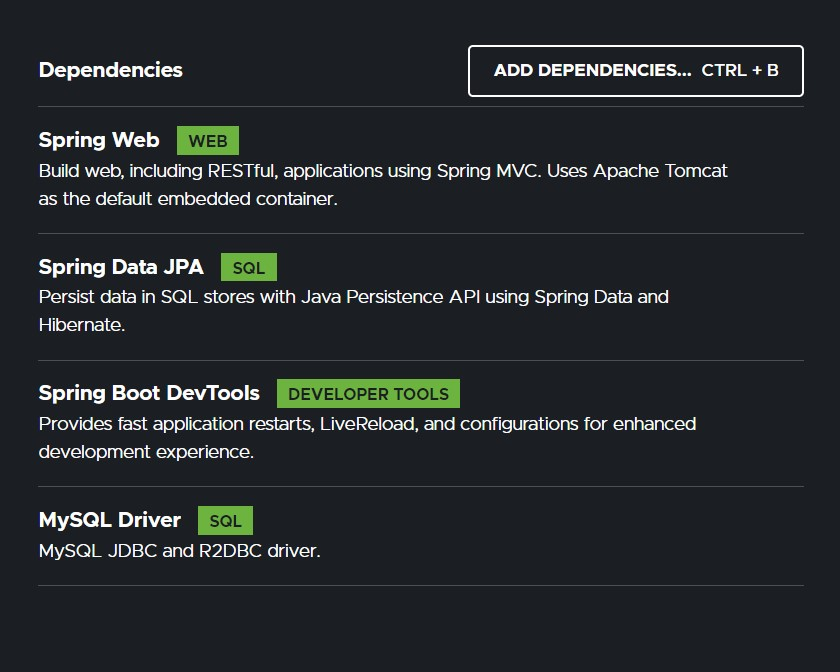
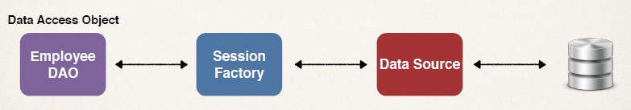
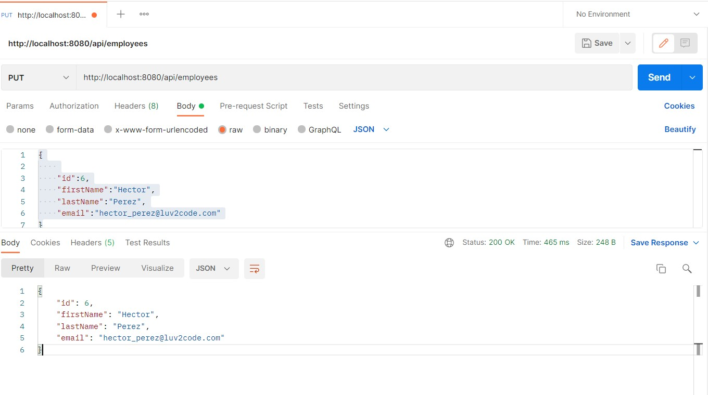
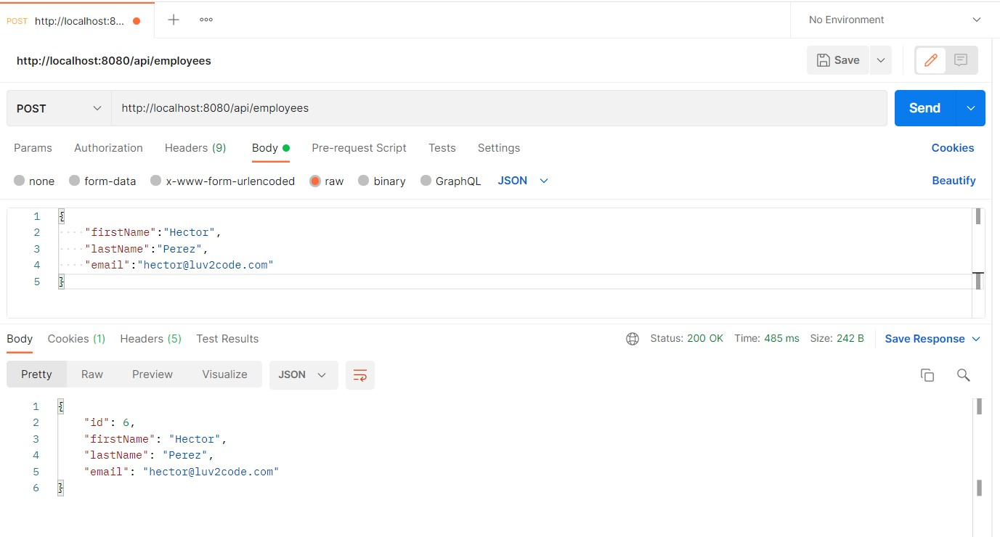

## REST API

|HTTP |Method |CRUD Action|
|-----|-------|-----------|
|POST |/api/employees |Create a new employee|
|GET |/api/employees| Read a list of employees|
|GET |/api/employees/{employeeId}| Read a single employee|
|PUT |/api/employees| Update an existing employee|
|DELETE |/api/employees/{employeeId}| Delete an existing employee|

## Development Process Step-By-Step
1. Set up Database Dev Environment
2. Create Spring Boot project using Spring Initializr
3. Get list of employees
4. Get single employee by ID
5. Add a new employee
6. Update an existing employee

## Step 1: Database Setup 
```sql
CREATE DATABASE  IF NOT EXISTS `employee_directory`;
USE `employee_directory`;

--
-- Table structure for table `employee`
--

DROP TABLE IF EXISTS `employee`;

CREATE TABLE `employee` (
  `id` int(11) NOT NULL AUTO_INCREMENT,
  `first_name` varchar(45) DEFAULT NULL,
  `last_name` varchar(45) DEFAULT NULL,
  `email` varchar(45) DEFAULT NULL,
  PRIMARY KEY (`id`)
) ENGINE=InnoDB AUTO_INCREMENT=1 DEFAULT CHARSET=latin1;

--
-- Data for table `employee`
--

INSERT INTO `employee` VALUES 
	(1,'Leslie','Andrews','leslie@luv2code.com'),
	(2,'Emma','Baumgarten','emma@luv2code.com'),
	(3,'Avani','Gupta','avani@luv2code.com'),
	(4,'Yuri','Petrov','yuri@luv2code.com'),
	(5,'Juan','Vega','juan@luv2code.com');


```

## Step 2: Spring Intializr


## Step 3: DAO 
- In the past, our DAO used a Hibernate Session Factory
- Hibernate Session Factory needs a Data Source
- The data source defines database connection info


### Traditional Spring
- We normally had to do this configuration manually

### Spring Boot to the Rescue
- Spring Boot will automatically configure your data source for you
- Based on entries from Maven pom file
- JDBC Driver: mysql-connector-java
- Spring Data (ORM): spring-boot-starter-data-jpa
- DB connection info from application.properties
```
spring.datasource.url=jdbc:mysql://localhost:3306/employee_directory
spring.datasource.username=springstudent
spring.datasource.password=springstudent
```
- No need to give JDBC driver class name 
- Spring Boot will automatically detect it based on URL
- [List of Data Source Properties](www.luv2code.com/spring-boot-props)

## Auto Data Source Configuration
- Based on configs, Spring Boot will automatically create the beans:
- DataSource, EntityManager, …
- You can then inject these into your app, for example your DAO
- EntityManager is from Java Persistence API (JPA)

## What is JPA?
- Java Persistence API (JPA)
- Standard API for Object-to-Relational-Mapping (ORM)
- Only a specification
- Defines a set of interfaces
- Requires an implementation to be usable
- [JPA Specification](http://www.luv2code.com/jpa-spec)

## JPA - Vendor Implementations
```
JPA Spec
    |
    +--Hibernate
    |
    +--EclipseLink
```
- [JPA Vendors](www.luv2code.com/jpa-vendors)

## What are Benefits of JPA
- By having a standard API, you are not locked to vendor's implementation
- Maintain portable, flexible code by coding to JPA spec (interfaces)
- Can theoretically switch vendor implementations
- For example, if Vendor ABC stops supporting their product
- You could switch to Vendor XYZ without vendor lock in


### Auto Data Source Configuration
- In Spring Boot, Hibernate is default implementation of JPA
- EntityManager is similar to Hibernate SessionFactory
- EntityManager can serve as a wrapper for a Hibernate Session object
- We can inject the EntityManager into our DAO

### Various DAO Techniques
- Version 1: Use EntityManager but leverage native Hibernate API
- Version 2: Use EntityManager and standard JPA API
- Version 3: Spring Data JPA

## Impl 
```java
public interface EmployeeDAO {
    public List<Employee> findAll();
}
```

```java
@Repository
public class EmployeeDAOHibernateImpl implements EmployeeDAO {
    private EntityManager entityManager;
    
    /// optional - Constructor injector( latest spring , automatically injects constructor with single args.)
    @Autowired
    public EmployeeDAOHibernateImpl(EntityManager theEntityManager) {
        entityManager = theEntityManager;
    }
    …
}
```

```java
@Override
@Transactional
public List<Employee> findAll() {
    // get the current hibernate session
    Session currentSession = entityManager.unwrap(Session.class);
    
    // create a query
    Query<Employee> theQuery =
    currentSession.createQuery("from Employee", Employee.class);
    
    // execute query and get result list
    List<Employee> employees = theQuery.getResultList();
    
    // return the results
    return employees;
}
```

## Development Process Step-By-Step
1. Update db configs in application.properties
2. Create Employee entity
3. Create DAO interface
4. Create DAO implementation
5. Create REST controller to use DAO

## Output 




