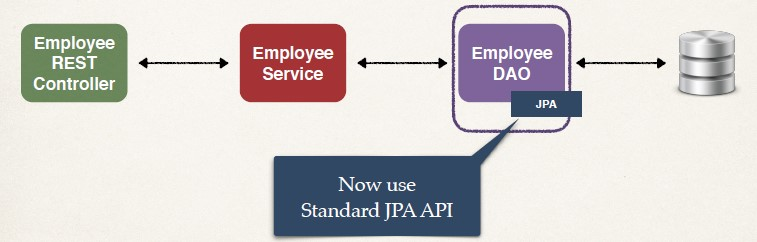

## Architecture


## Remember the Benefits of JPA
- By having a standard API, you are not locked to vendor's implementation
- Maintain portable, flexible code
- Can theoretically switch vendor implementations
- If Vendor ABC stops supporting their product
- Switch to Vendor XYZ without vendor lock in

## Standard JPA API
- The JPA API methods are similar to Native Hibernate API
- JPA also supports a query language: JPQL (JPA Query Language)
- For more details on JPQL, see this link
- [jpql](www.luv2code.com/jpql)

## Comparing JPA to Native Hibernate Methods

|Action |Native Hibernate method| JPA method|
|-------|-----------------------|-----------|
|Create/save new entity| session.save(…)| entityManager.persist(…)|
|Retrieve entity by id| session.get(…) / load(…)| entityManager.find(…)|
|Retrieve list of entities |session.createQuery(…)| entityManager.createQuery(…)|
|Save or update entity |session.saveOrUpdate(…)| entityManager.merge(…)|
|Delete entity |session.delete(…)| entityManager.remove(…)|

- High-level comparison, other options are available depending on context …

## DAO Impl
```Java
@Repository
public class EmployeeDAOJpaImpl implements EmployeeDAO {
    private EntityManager entityManager;
        
        @Autowired
        public EmployeeDAOJpaImpl(EntityManager theEntityManager) {
            entityManager = theEntityManager;
        }
    …
}
```

## Get a list of Employee
```Java
@Override
public List<Employee> findAll() {
    
    // create a query
    TypedQuery<Employee> theQuery =
                    entityManager.createQuery("from Employee", Employee.class);
    
    // execute query and get result list
    List<Employee> employees = theQuery.getResultList();
    
    // return the results
    return employees;
}
```

## Get a single Employee
```java
@Override
public Employee findById(int theId) {
    // get employee
    Employee theEmployee = entityManager.find(Employee.class, theId);
    
    // return employee
    return theEmployee;
}
```

## Add or Update Employee 
```java
@Override
public void save(Employee theEmployee) {
    // save or update the employee
    // if id == 0 then save/insert else update
    Employee dbEmployee = entityManager.merge(theEmployee);
    
    // update with id from db ... so we can get generated id for save/insert
    theEmployee.setId(dbEmployee.getId());
}   
```

## Delete an existing employee
```java
@Override
public void deleteById(int theId) {
    
    // delete object with primary key
    Query theQuery = entityManager.createQuery("delete from Employee where id=:employeeId");
    
    theQuery.setParameter("employeeId", theId);
    
    theQuery.executeUpdate();
}
```