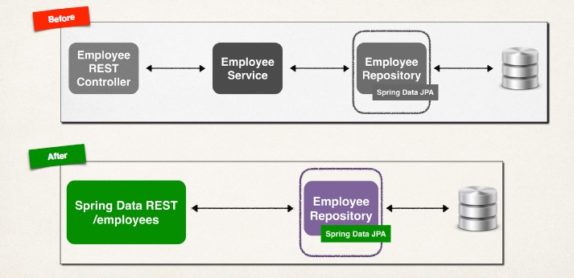

## The Problem
- We saw how to create a REST API for Employee
- Need to create REST API for another entity?
- Customer, Student, Product, Book …
- Do we have to repeat all of the same code again???

## My Wish 
- I wish we could tell Spring:
- Create a REST API for me
- Use my existing JpaRepository (entity, primary key)
- Give me all of the basic REST API CRUD features for free

## Spring Data REST - Solution
- Spring Data REST is the solution!!!!
- Leverages your existing JpaRepository
- Spring will give you a REST CRUD implementation for FREE …. like MAGIC!!
- Helps to minimize boiler-plate REST code!!!
- No new coding required!!!

## REST API 
- Spring Data REST will expose these endpoints for free!


|HTTP |Method |CRUD Action|
|-----|-------|-----------|
|POST |/api/employees |Create a new employee|
|GET |/api/employees| Read a list of employees|
|GET |/api/employees/{employeeId}| Read a single employee|
|PUT |/api/employees| Update an existing employee|
|DELETE |/api/employees/{employeeId}| Delete an existing employee|

## Spring Data REST - How Does It Work?
• Spring Data REST will scan your project for JpaRepository
• Expose REST APIs for each entity type for your JpaRepository
```java
public interface EmployeeRepository extends JpaRepository<Employee, Integer> {
}
```

## REST Endpoints
- By default, Spring Data REST will create endpoints based on entity type
- Simple pluralized form
- First character of Entity type is lowercase
- Then just adds an "s" to the entity
public interface EmployeeRepository extends JpaRepository<Employee, Integer> {
}

## Development Process Step-By-Step
1. Add Spring Data REST to your Maven POM file
```xml
<dependency>
    <groupId>org.springframework.boot</groupId>
    <artifactId>spring-boot-starter-data-rest</artifactId>
</dependency>
```

## In A Nutshell
- For Spring Data REST, you only need 3 items
    1. Your entity: Employee
    2. JpaRepository: EmployeeRepository extends JpaRepository
    3. Maven POM dependency for: spring-boot-starter-data-rest

## Application Architecture 


## HATEOAS
- Spring Data REST endpoints are HATEOAS compliant
- HATEOAS: Hypermedia as the Engine of Application State
- Hypermedia-driven sites provide information to access REST interfaces
- Think of it as meta-data for REST data
- [HATEOAS](https://spring.io/understanding/HATEOAS)
- Spring Data REST response using HATEOAS
- For example REST response from: GET /employees/3
```json
{
    "firstName": "Avani",
    "lastName": "Gupta",
    "email": "avani@luv2code.com",
    "_links": {
        "self": {
            "href": "http://localhost:8080/employees/3"
        },
        "employee": {
            "href": "http://localhost:8080/employees/3"
        }
    }
}
```
- For a collection, meta-data includes page size, total elements, pages etc
- For example REST response from: GET /employees
```json
{
    "_embedded": {
        "employees": [
        {
            "firstName": "Leslie",
            ...
        },
        ...
        ]
    },
    "page": {
        "size": 20,
        "totalElements": 5,
        "totalPages": 1,
        "number": 0
    }
}
```
- HATEOAS uses Hypertext Application Language (HAL) data format
- For details on HAL, see [here](https://en.wikipedia.org/wiki/Hypertext_Application_Language)

## Advanced Features
- Spring Data REST advanced features
- Pagination, sorting and searching
- Extending and adding custom queries with JPQL
- Query Domain Specific Language (Query DSL)
- [Advanced Feature](https://spring.io/projects/spring-data-rest)

## Adding properties for custom context 
```
#
# Spring Data REST properties 
# 
spring.data.rest.base-path=/magic-api
```

## REST Endpoints
- By default, Spring Data REST will create endpoints based on entity type
- Simple pluralized form
- First character of Entity type is lowercase
- Then just adds an "s" to the entity
```java
public interface EmployeeRepository extends JpaRepository<Employee, Integer> {
}
```
- But The English language is VERY complex!
- Spring Data REST does NOT handle

## Problem
- Spring Data REST does not handle complex pluralized forms
- In this case, you need to specify plural name
- What if we want to expose a different resource name?
- Instead of /employees … use /members

## Solution
- Specify plural name / path with an annotation
```java
@RepositoryRestResource(path="members")
public interface EmployeeRepository extends JpaRepository<Employee, Integer> {
}
```
`http://localhost:8080/members`

## Pagination
- By default, Spring Data REST will return the first 20 elements
- Page size = 20
- You can navigate to the different pages of data using query param
```
http://localhost:8080/employees?page=0
http://localhost:8080/employees?page=1
```

## Spring Data REST Configuration
- Following properties available: application.properties
|Name |Description|
|-----|-----------|
|spring.data.rest.base-path |Base path used to expose repository resources|
|spring.data.rest.default-page-size |Default size of pages|
|spring.data.rest.max-page-size| Maximum size of pages|

## Sample Configuration
**application.properties**
```
spring.data.rest.base-path=/magic-api
spring.data.rest.default-page-size=50
```

## Sorting 
- You can sort by the property names of your entity
    - In our Employee example, we have: firstName, lastName and email
- Sort by last name (ascending is default)
`http://localhost:8080/employees?sort=lastName`

- Sort by first name, descending
`http://localhost:8080/employees?sort=firstName,desc`

- Sort by last name, then first name, ascending
`http://localhost:8080/employees?sort=lastName,firstName,asc`