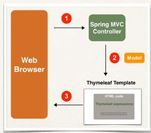
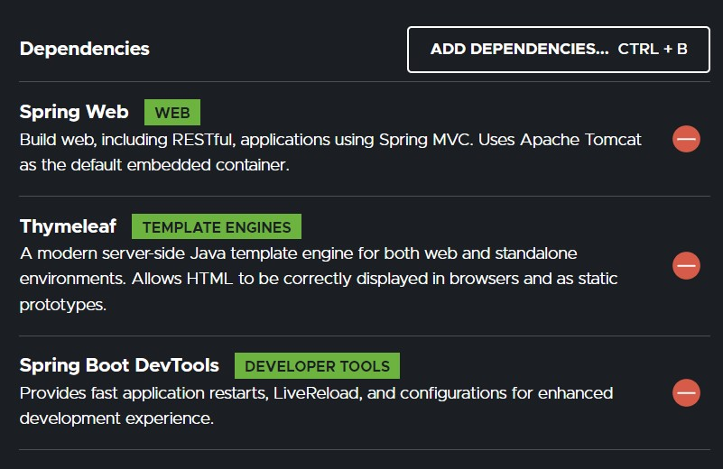
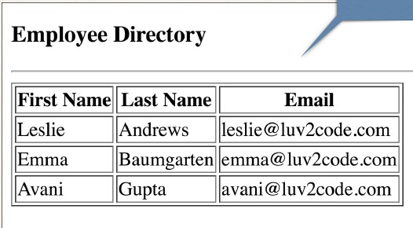
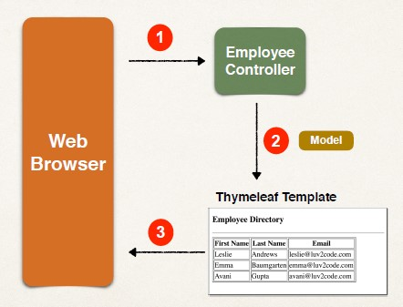

## What is Thymeleaf?
- Thymeleaf is a Java templating engine
- Commonly used to generate the HTML views for web apps
- However, it is a general purpose templating engine
- Can use Thymeleaf outside of web apps (more on this later)

## Architecture 



## What is a Thymeleaf template?
- Can be an HTML page with some Thymeleaf expressions
- Include dynamic content from Thymeleaf expressions
- Can access Java code, objects Spring beans

## Where is the Thymeleaf template processed?
- In a web app, Thymeleaf is processed on the server
- Results included in HTML returned to browser

## Thymeleaf vs JSP
- Yes, Thymeleaf is similar to JSP
    - Can be used for web view templates
- One key difference
    - JSP can only be used in a web environment
    - Thymeleaf can be used in web OR non-web environments

## Thymeleaf Use Cases (non-web)
- Email Template
    - When student signs up for a course then send welcome email
- CSV Template
    - Generate a monthly report as CSV then upload to Google drive
- PDF Template
    - Generate a travel confirmation PDF then send via email

## FAQ: Should I use JSP or Thymeleaf?
- Depends on your project requirements
- If you only need web views you can go either way
- If you need a general purpose template engine (non-web) use Thymeleaf
- If you want to impress your interviewer, mention Thymeleaf … LOL

## Development Process Step-By-Step
1. Add Thymeleaf to Maven POM file
```xml
<dependency>
    <groupId>org.springframework.boot</groupId>
    <artifactId>spring-boot-starter-thymeleaf</artifactId>
</dependency>
```
2. Develop Spring MVC Controller
**DemoController.java**
```java
@Controller
public class DemoController {
    @GetMapping("/")
    public String sayHello(Model theModel) {
        theModel.addAttribute("theDate", new java.util.Date());
        
        /// src/main/resources/templates/helloworld.html
        return "helloworld";
    }
}
```
3. Create Thymeleaf template

## Where to place Thymeleaf template?
- In Spring Boot, your Thymeleaf template files go in
- `src/main/resources/templates`
- For web apps, Thymeleaf templates have a .html extension

```html
<!DOCTYPE HTML>
<html xmlns:th="http://www.thymeleaf.org">
    <head> … </head>
    <body>
        <p th:text="'Time on the server is ' + ${theDate}" />
    </body>
</html>
```

## Additional Features
- Looping and conditionals
- CSS and JavaScript integration
- Template layouts and fragments
- Addittional details on `www.thymeleaf.org`

## Dependencies 


## Using CSS with Thymleaf Templates
- You have the option of using
- Local CSS files as part of your project
- Referencing remote CSS files

## Step 1: Create CSS file
- Spring Boot will look for static resources in the directory
- `src/main/resources/static`
- You can create your own custom sub-directories
```
static/css
static/images
static/js
```
**src/main/resources/static/css/demo.css**
```css
.funny {
    font-style: italic;
    color: green;
}
```

## Step 2 : Reference CSS in Thymeleaf template and Apply CSS
**helloworld.html**
```html
<head>
<title>Thymeleaf Demo</title>
<!-- reference CSS file -->
<link rel="stylesheet" th:href="@{/css/demo.css}" />


</head>
<body>
    <p th:text="'Time on the server is ' + ${theDate}" class="funny" />
</body>
```

## Other search directories
- Spring Boot will search following directories for static resources:
- Search order : `top-down`
```
/src/main/resources
1. /META-INF/resources
2. /resources
3. /static
4. /public
```

## 3rd Party CSS Libraries - Bootstrap
- Local Installation
- Download Bootstrap file(s) and add to /static/css directory
- using bootstrap.min.css at **src/main/resources/static/css/bootstrap.min.css**
```html
<head>
… …
    <!-- reference CSS file -->
    <link rel="stylesheet" th:href="@{/css/bootstrap.min.css}" />
</head>
```

## Remote Files
```html
<head>
… …
<!-- reference CSS file -->
<link rel="stylesheet"
href="https://stackpath.bootstrapcdn.com/bootstrap/4.2.1/css/bootstrap.min.css" />
… …
</head>
```

## HTML Tables using Thymeleaf 


## Architecture 


## Development Process
1. Create Employee class
2. Create Employee Controller
3. Create Thymeleaf template

## Step 1: Create Employee class
- Regular Java class: fields, constructors, getters / setters
```java
package com.luv2code.springboot.thymleafdemo.model;


public class Employee {
	

	private int id; 
	
	private String firstName;
	
	private String lastName; 
	
	private String email; 
	
	Employee(){}
	
	
	public Employee(String firstName, String lastName, String email) {
		this.firstName = firstName;
		this.lastName = lastName;
		this.email = email;
	}


	public String getFirstName() {
		return firstName;
	}

	public void setFirstName(String firstName) {
		this.firstName = firstName;
	}

	public String getLastName() {
		return lastName;
	}

	public void setLastName(String lastName) {
		this.lastName = lastName;
	}

	public String getEmail() {
		return email;
	}

	public void setEmail(String email) {
		this.email = email;
	}

	public int getId() {
		return id;
	}
	
	public void setId(int id) {
		this.id = id;
	}

	@Override
	public String toString() {
		return "Employee [id=" + id + ", firstName=" + firstName + ", lastName=" + lastName + ", email=" + email + "]";
	}


	
	
	
	
}

```

## Step 2: Create Employee Controller
```java
@RequestMapping("/employees")
public class EmployeeController {
    @GetMapping("/list")
    public String listEmployees(Model theModel) {
        // create employees
        Employee emp1 = new Employee(1, "Leslie", "Andrews", "leslie@luv2code.com");
        Employee emp2 = new Employee(2, "Emma", "Baumgarten", "emma@luv2code.com");
        Employee emp3 = new Employee(3, "Avani", "Gupta", "avani@luv2code.com");
        
        // create the list
        List<Employee> theEmployees = new ArrayList<>();
        
        // add to the list
        theEmployees.add(emp1);
        theEmployees.add(emp2);
        theEmployees.add(emp3);
        
        // add to the Spring MVC model
        theModel.addAttribute("employees", theEmployees);
        return "list-employees";
    }
}
```

## Step 3: Create html file using Thymeleaf
```html
<table border="1">
    <thead>
        <tr>
            <th>First Name</th>
            <th>Last Name</th>
            <th>Email</th>
        </tr>
    </thead>
    <tbody>
        <tr th:each="tempEmployee : ${employees}">
            <td th:text="${tempEmployee.firstName}" />
            <td th:text="${tempEmployee.lastName}" />
            <td th:text="${tempEmployee.email}" />
        </tr>
    </tbody>
</table>
```


## Adding Styling to tables 
- Development Process
    1. Get links for remote Bootstrap files
        -  Visit Bootstrap website: www.getbootstrap.com
        - Website has instructions on how to Get Started
    2. Add links in Thymeleaf template
    3. Apply Bootstrap CSS styles