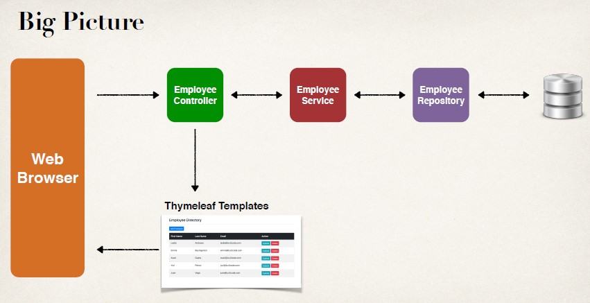

## Architecture 
- Do remember this is a CRUD project, not REST 


## Project Set Up
- We will extend our existing Employee project and add DB integration
- Add EmployeeService, EmployeeRepository and Employee entity
- Available in one of our previous projects
- We created all of this code already from scratch … so we'll just copy/paste it
- Allows us to focus on creating EmployeeController and Thymeleaf templates

## HTML trick to redirect to particular path 
```html
<meta http-equiv="refresh"
	  content="0; URL='employees/list'">
```

## Add Employee
1. New Add Employee button for list-employees.html
2. Create HTML form for new employee
3. Process form data to save employee

## Step 1: New "Add Employee" button
- Add Employee button will href link to
- request mapping /employees/showFormForAdd
```html
<a th:href="@{/employees/showFormForAdd}" class="btn btn-primary btn-sm mb-3"> Add Employee </a>
```

## Showing Form
- In your Spring Controller
    - Before you show the form, you must add a model attribute
    - This is an object that will hold form data for the data binding

## Controller code to show form
```java
@Controller
@RequestMapping("/employees")
public class EmployeeController {
    
    @GetMapping("/showFormForAdd")
    public String showFormForAdd(Model theModel) {
    
    // create model attribute to bind form data
    Employee theEmployee = new Employee();
    
    ///Our Thymleaf template will access this data for binding form data
    theModel.addAttribute("employee", theEmployee);
    
    /// src/main/resources/templates/employees/employee-form.html
    return "employees/employee-form";
    }
    …
}
```

## Thymeleaf and Spring MVC Data Binding
- Thymeleaf has special expressions for binding Spring MVC form data
- Automatically setting / retrieving data from a Java object

## Thymeleaf Expressions
- Thymeleaf expressions can help you build the HTML form :-)
|Expression| Description|
|----------|------------|
|th:action |Location to send form data|
|th:object| Reference to model attribute|
|th:field| Bind input field to a property on model attribute|
|more …. |See - www.luv2code.com/thymeleaf-create-form|

## Step 2: Create HTML form for new employee
```html
<form action="#" th:action="@{/employees/save}"
    th:object="${employee}" method="POST">
    
    <input type="text" th:field="*{firstName}" placeholder="First name"
    class="form-control mb-4 col-4">
    
    <input type="text" th:field="*{lastName}" placeholder="Last name"
    class="form-control mb-4 col-4">
    
    <input type="text" th:field="*{email}" placeholder="Email"
    class="form-control mb-4 col-4">
    
    <button type="submit" class="btn btn-info col-2">Save</button>
</form>
```
- When form is loaded, will call:
```
employee.getFirstName()
…
employee.getLastName
```
- When form is submitted, will call:
```
employee.setFirstName(…)
…
employee.setLastName(…)
```

## Step 3: Process form data to save employee
```java
@Controller
@RequestMapping("/employees")
public class EmployeeController {
    private EmployeeService employeeService;
    
    public EmployeeController(EmployeeService theEmployeeService) {
        employeeService = theEmployeeService;
    }
    
    @PostMapping("/save")
    public String saveEmployee(@ModelAttribute("employee") Employee theEmployee) {
        // save the employee
        employeeService.save(theEmployee);

        // use a redirect to prevent duplicate submissions
        return "redirect:/employees/list";
    }
    …
}
```

## Query Methods 
- [Search Here](www.luv2code.com/query-methods)

## Update Employee
1. "Update" button
2. Pre-populate the form
3. Process form data

```html
<tr th:each="tempEmployee : ${employees}">
…
<td>
    <a th:href="@{/employees/showFormForUpdate(employeeId=${tempEmployee.id})}"
    class="btn btn-info btn-sm">
    Update
    </a>
</td>
</tr>
```
- Basically appends the id to the url 
```
?employeeId=xxx
```
## 2.
```java
@Controller
@RequestMapping("/employees")
public class EmployeeController {
    …
    @GetMapping("/showFormForUpdate")
    public String showFormForUpdate(@RequestParam("employeeId") int theId,
        Model theModel) {
        
        // get the employee from the service
        Employee theEmployee = employeeService.findById(theId);
        
        // set employee as a model attribute to pre-populate the form
        theModel.addAttribute("employee", theEmployee);
        
        // send over to our form
        return "employees/employee-form";
    }
}
```
```html
<form action="#" th:action="@{/employees/save}"
    th:object="${employee}" method="POST">
    <!-- Add hidden form field to handle update -->
    <input type="hidden" th:field="*{id}" />
    
    <input type="text" th:field="*{firstName}"
    class="form-control mb-4 col-4" placeholder="First name">
    
    <input type="text" th:field="*{lastName}"
    class="form-control mb-4 col-4" placeholder="Last name">
    
    <input type="text" th:field="*{email}"
    class="form-control mb-4 col-4" placeholder="Email">
    
    <button type="submit" class="btn btn-info col-2">Save</button>
</form>
```

## 3: Process form data to save employee
- No need for new code … we can reuse our existing code
- Works the same for add or update :-)
```java
@Controller
@RequestMapping("/employees")
public class EmployeeController {
…
    @PostMapping("/save")
    public String saveEmployee(@ModelAttribute("employee") Employee theEmployee) {
        
        // save the employee
        employeeService.save(theEmployee);
        
        // use a redirect to prevent duplicate submissions
        return "redirect:/employees/list";
    }
…
}
```

## Deleting the customer 
- Adding the button
```html
<td>
...
				    <a th:href="@{/employees/delete(employeeId=${tempEmployee.id})}"
				    class="btn btn-danger btn-sm"
				    onclick="if(!(confirm('Are you sure you want to delete this employee?'))) return false">
				    Delete
				    </a>
</td>
```

- Updating the controller 
```java
@GetMapping("/delete")
	public String deleteEmployee(@RequestParam("employeeId") int theId) {
		employeeService.deleteById(theId);
		return "redirect:/employees/list";
}
```
